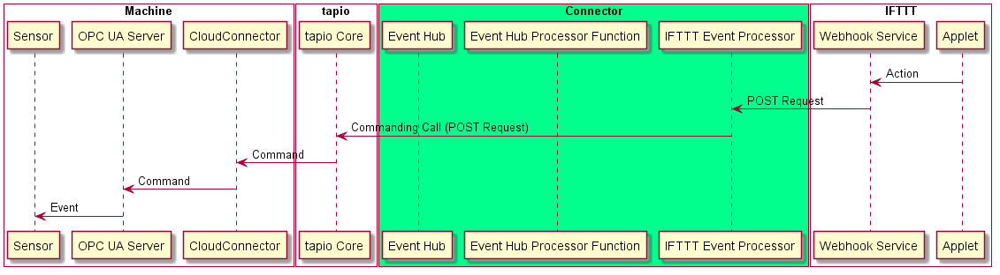
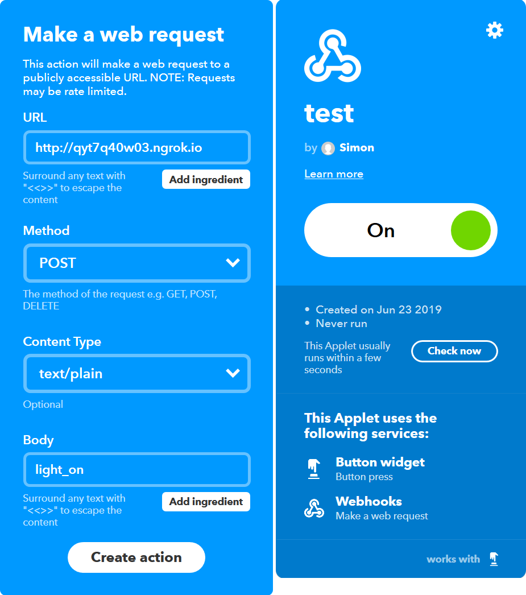

# Connecting the digital worlds (2/3)

In the [previous article][article_1] we clarified the idea of the challenge and set up a demo machine. In this article we take on the implementation of the first route of events in the tapio-IFTTT-Connector: From IFTTT to tapio-ready machines.

* [Connecting the digital worlds (1/3)][article_1]
* [Connecting the digital worlds (2/3)][article_2]
* [Connecting the digital worlds (3/3)][article_3]



As [previously specified][article_1] we want to use the webhook component

we want to use a serverless approach to wait for calls to safe money

azure function

how to debug?

ngrok! forward a local port to a ngrok link

download ngrok

gen authtoken for account

```powershell
PS C:\Program Files\ngrok> ./ngrok authtoken 73tnJLcq4jmjLirCbAopr_6xfRJJcYtcGOEFejCvRU9
Authtoken saved to configuration file: C:\Users\Simon/.ngrok2/ngrok.yml   
```

forward azure function running on localhost:1337 to the internet

```powershell
PS C:\Program Files\ngrok> ./ngrok http 1337
```

monitor the calls passed through the tunnel

```shell
ngrok by @inconshreveable                               (Ctrl+C to quit)

Session Status      online
Account             (Plan: Free)
Version             2.3.30
Region              United States (us)
Web Interface       http://127.0.0.1:4040
Forwarding          http://qyt7q40w03.ngrok.io -> http://localhost:1337
Forwarding          https://qyt7q40w03.ngrok.io -> http://localhost:1337

Connections         ttl     opn     rt1     rt5     p50     p90
                    2       0       0.01    0.01    2.31    2.31

HTTP Requests
-------------

GET /WebhookProcessorFunction               200 OK
```

there is also a web interface with more details

configure a test applet to send calls with light_on body to ngrok tunnel for testing



on get or post request make a commanding api item write request with body from request transformed to event type

```csharp
[FunctionName("WebhookProcessorFunction")]
public static async Task<IActionResult> Run(
    [HttpTrigger(AuthorizationLevel.Function, "get", "post", Route = null)] HttpRequest req,
    ILogger log, Microsoft.Azure.WebJobs.ExecutionContext context, CancellationToken cancellationToken)
{
    log.LogInformation("C# HTTP trigger function processed a request.");

    var eventName = await new StreamReader(req.Body).ReadToEndAsync();

    await CallCommandAsync(new Command
    {
        CommandType = "itemWrite",
        Id = "ProcessEvent",
        ServerId = Config["ServerId"],
        TapioMachineId = Config["TapioMachineId"], 
        Arguments = new Dictionary<string, CommandArgument> { { "value", new CommandArgument{ Value = JsonConvert.SerializeObject(EventFactory.Create(eventName)), ValueType = CommandArgumentTypeHelper.String.Value }}}
    }, cancellationToken);

    return new OkObjectResult("The command was processed successfully");
}
```

Available events could be provided dynamically for simplicities sake on 3 event types

```csharp
public static class EventFactory
{
    public static Event Create(string eventName)
    {
        switch (eventName)
        {
            case "light_on":
                return new Event { Name = eventName };
            case "light_off":
                return new Event { Name = eventName };
            case "light_sequence1":
                return new Event
                {
                    Name = eventName, Payload = JsonConvert.SerializeObject(new LedSequence
                    {
                        CycleCount = 25, LedSettings = new List<LedSetting>
                        {
                            new LedSetting
                            {
                                Duration = TimeSpan.FromSeconds(3), RGB = new RGB {Blue = 255, Green = 0, Red = 0}
                            },
                            new LedSetting
                            {
                                Duration = TimeSpan.FromSeconds(6), RGB = new RGB {Blue = 0, Green = 255, Red = 0}
                            },
                            new LedSetting
                                {Duration = TimeSpan.FromSeconds(9), RGB = new RGB {Blue = 0, Green = 0, Red = 255}}
                        }
                    })
                };
        }

        throw new Exception("Unknown event");
    }
}
```

Add commanding command configuration to datamodule config of the tapio cloudconnector

```xml
<Module xsi:type="DataModuleConfig">
      <Id>DataModule01</Id>
      <Source>
        <Servers>
          <SourceBase xsi:type="SourceOpcUa">
            <Id>SensorServer</Id>
            <OpcServer>opc.tcp://localhost:420</OpcUaServer>
            <Commanding>
              <Commands>
                  <Command xsi:type="CommandItemWrite">
                    <Id>ProcessEvent</Id>
                    <TapioMachineId>741ab3a2-040a-44bf-b8ce-4333d567a99a</TapioMachineId>
                    <NodeId>ns=2;s=PiSensorServer.ProcessEventCommandState</NodeId>
                  </Command>
                </Commands>
            </Commanding>
            <Groups>
          </SourceBase>
        </Servers>
      </Source>
</Module>
```

Create commanding command node on the opc ua server and add eventhandler for write events

```csharp
protected override void CreateAddressSpace()
{
    base.CreateAddressSpace();

    _ProcessEventCommandDataVariableState = new DataVariableState(false, "ProcessEventCommandState", RootFolder, SystemContextObject, typeof(string));
    _ProcessEventCommandDataVariableState.WriteCalled += OnProcessEventCommandWrite;

    AddNode(_ProcessEventCommandDataVariableState);
}
```

Event handler for write events. interpret events here. could also be dynamic

```csharp
private void OnProcessEventCommandWrite(object sender, ValueWriteEventArgs e)
{
    Console.WriteLine($"Command received with arg: {e?.Value}");

    var eventData = JsonConvert.DeserializeObject<Event>(e.Value.ToString());
    
    try
    {
        switch (eventData?.Name)
        {
            case "light_on":
                Console.WriteLine("Setting light on");
                _LedController.SetColor(255, 255, 255);
                Console.WriteLine("Setting light on done");
                break;
            case "light_off":
                Console.WriteLine("Setting light off");
                _LedController.SetColor(0, 0, 0);
                Console.WriteLine("Setting light off done");
                break;
            case "light_sequence":
                Console.WriteLine("Starting led sequence");
                _LedController.ProcessSequence(JsonConvert.DeserializeObject<LedSequence>(eventData?.Payload));
                Console.WriteLine("led sequence done");
                break;
            default:
                Console.WriteLine("Could not detect event type. Ignoring event.");
                break;
        }
    }
    catch (Exception)
    {
        Console.WriteLine("Processing event failed. Ignoring event.");
    }
}
```

interfaces for leds

```csharp
public interface ILedController
{
    Task ProcessSequence(LedSequence ledSequence);

    void SetColor(int red, int green, int blue);
}

public interface ILed
{
    void SetColor(int red, int green, int blue);
}
```

talk to leds connected to the gpio pins of the pi

```csharp
public class Led : ILed
{
    private const int _MaxColorValue = 255;

    private GpioPin _RedPin;
    private GpioPin _BluePin;
    private GpioPin _GreenPin;

    public Led(int redBcm, int greenBcm, int blueBcm)
    {
        Pi.Init<BootstrapWiringPi>();
        _RedPin = InitializeGpioPin(redBcm);
        _GreenPin = InitializeGpioPin(greenBcm);
        _BluePin = InitializeGpioPin(blueBcm);
    }

    public void SetColor(int red, int green, int blue)
    {
        CheckColorRange(red, nameof(red));
        CheckColorRange(green, nameof(green));
        CheckColorRange(blue, nameof(blue));

        _RedPin.SoftPwmValue = (int) red / _MaxColorValue * 100;
        _GreenPin.SoftPwmValue = (int) green / _MaxColorValue * 100;
        _BluePin.SoftPwmValue = (int) blue / _MaxColorValue * 100;
    }

    private GpioPin InitializeGpioPin(int bcm)
    {
        var pin = (GpioPin)Pi.Gpio[bcm];
        pin.PinMode = GpioPinDriveMode.Output;
        pin.StartSoftPwm(1, _MaxColorValue);
        pin.SoftPwmValue = 0;
        return pin;
    }

    private void CheckColorRange(int color, string paramName)
    {
        if(color < 0 || color > _MaxColorValue)
        {
            throw new ArgumentException($"Color value ({color}) out of accepted range (0..{_MaxColorValue}).", paramName);
        }
    }
}
```


The tapio commanding API is normally used to alter items or call methods on a OPC UA server associated with the CloudConnector but we figured we can use a item write request to transmit an event. On OPC UA server side we then just had to wait for item state changes and interpret them as events. In detail we used an `DataVariableState` of type `String` and used the value to transmit a serialized JSON object, which contained metadata about the event.
When we noticed that our connector only had to listen for a http request and then make another http request we opted for a [serverless](https://martinfowler.com/articles/serverless.html) approach using an [Azure Function](https://docs.microsoft.com/en-us/azure/azure-functions/) to save time (A Azure Function basically is a piece of code which gets executed when a certain condition arises).

For testing our function the command-line program [ngrok](https://ngrok.com/) came in handy. Through ngrok you can expose a local development server to the internet. This way you can debug webhooks directly on your local machine without exposing ports or renting a webserver.

To access the GPIO pins we used the NuGet packages [Unosquare.RaspberryIO](https://github.com/unosquare/raspberryio) and [System.Device.Gpio](https://www.nuget.org/packages/System.Device.Gpio). The latter even offered the possibility to provide a custom event handler for GPIO pin status changes which simplified listening for events by a bit.

[article_1]: https://www.tapio.one/en/blog/connecting-the-digital-worlds-1-3
[article_2]: https://www.tapio.one/en/blog/connecting-the-digital-worlds-2-3
[article_3]: https://www.tapio.one/en/blog/connecting-the-digital-worlds-3-3
