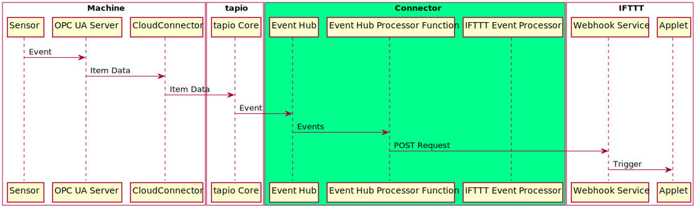

# Connecting the digital worlds (3/3)



```csharp
public class MotionSensorMonitor : IMotionSensorMonitor
{
    private int _Pin;

    public event EventHandler OnMotion;

    public MotionSensorMonitor(int pinBoardNumber)
    {
        _Pin = pinBoardNumber;
        var controller = new GpioController(PinNumberingScheme.Board);
        controller.OpenPin(_Pin);
        controller.SetPinMode(_Pin, PinMode.Input);
        controller.RegisterCallbackForPinValueChangedEvent(_Pin, PinEventTypes.Rising, (sender, args) =>
        {
            OnMotion?.Invoke(this, new EventArgs());
        });
    }
}
```

```csharp
protected override void CreateAddressSpace()
{
    base.CreateAddressSpace();

    _MotionSensorState = new DataVariableState<string>(false, "MotionSensorState", RootFolder, SystemContextObject);

    AddNode(_MotionSensorState);
}
```

```csharp
public void OnMotionDetected()
{
    if(_MotionSensorState == null)
    {
        throw new InvalidOperationException("Please create the base event state first");
    }
    _MotionSensorState.StatusChanged("Motion detected", StatusCodes.Good);
    Console.WriteLine("Reported motion sensor event.");
}
```

```csharp
static void Main(string[] args)
{
    var led = new Led(16, 20, 21);
    var ledController = new LedController(led);
    var motionSensorMonitor = new MotionSensorMonitor(10);
    var nodeManager = new NodeManager(ledController, motionSensorMonitor);
    var server = new Server(nodeManager);
    motionSensorMonitor.OnMotion += nodeManager.OnMotionDetected;
}
```

cc / tapio magic => event hub

https://developer.tapio.one/docs/TapioDataCategories.html

```json
{
  "tmid": "741ab3a2-040a-44bf-b8ce-4333d567a99a", // machine id
  "msgid": "bf8610fa-a5e9-4ede-ad37-51082e7eb372", // message id
  "msgt": "itd", // message type
  "msgts": "2017-06-29T10:39:03.7651013+01:00", // ISO8601 timestamp 
  "msg":  {
    "p": "pi", // provider name
    "k": "MotionSensorState", // key, usually the node id
    "vt": "s", // data value type (string)
    "v": "some data for IFTTT to play with :)",
    "q": "g", // quality of the value (OPC UA thing)
    "sts": "2017-06-29T10:38:43.7606016+01:00", // ISO8601 timestamp by OPC UA server
    "rts": "2017-06-29T10:38:53.7606016+01:00" // ISO8601 timestamp by CloudConnector
  }
}
```

```csharp
[FunctionName("EventHubProcessorFunction")]
public static async void Run([IoTHubTrigger("ifttt", Connection = "EventHubConnection")]EventData message,
ILogger log, Microsoft.Azure.WebJobs.ExecutionContext context,
CancellationToken cancellationToken)
{
    log.LogInformation($"C# IoT Hub trigger function processed a message: {Encoding.UTF8.GetString(message.Body.Array)}");

    var eventHubMessage = JsonConvert.DeserializeObject<EventHubMessage>(Encoding.UTF8.GetString(message.Body.Array));
    if(eventHubMessage.MessageType != "itd")
    {
        log.Log(LogLevel.Debug, $"Ignoring non-ItemData streaming data: {Encoding.UTF8.GetString(message.Body.Array)}");
        return;
    }

    var tapioEvent = JsonConvert.DeserializeObject<TapioEvent>(JsonConvert.SerializeObject(eventHubMessage.Message));

    if (tapioEvent.Provider != "pi")
    {
        log.Log(LogLevel.Debug, $"Ignoring non-event related data: {Encoding.UTF8.GetString(message.Body.Array)}");
        return;
    }

    await SendEventToIFTTT(tapioEvent, log);

    log.Log(LogLevel.Information, $"Action was sent successfully.");
}
```


After the first event flow worked we started working on the second:

1. A sensor of a machine changed its state.
2. The state change was forwarded to the machines OPC UA server.
3. The OPC UA server invoked a OPC UA event.
4. The CloudConnector forwarded the event to the tapio core.
5. The tapio core forwarded the event to a custom EventHub (preconfigured for given tapio machine id).
6. The connector received a new event in the EventHub.
7. The connector forwarded the event via webhook to IFTTT.
8. An IFTTT-Applet triggered an action from any service.

An [Azure EventHub](https://azure.microsoft.com/en-us/services/event-hubs/) can listen for many events at the same time and provide a queue which event consumers can work through to process all events. We set up an EventHub instance in Azure and connected it through [my tapio](https://admin.tapio.one/) with our machine. Then we set up another Azure Function which consumed events from given EventHub and forwarded them to IFTTT through the webhook service.

## Conclusion

That's it! Two Azure Functions, an EventHub, a Raspberry Pi and three workdays later we're able to present a functioning prototype. For our demo on day four we logged motion sensor data through our connector into a Google Drive sheet, turned on a RGB LED with the press of a widget button on a smartphone and configured a new IFTTT-Applet live. We didn't develop a shippable product but built a working proof of concept which can be transformed into a proper solution. Authentication, authorization and a web interface for configuring events to be be forwarded on a per machine basis for example are tasks still to be done.

Aside from resolving the actual challenges the hackathon was most notably a fun event with awesome attendees who helped each other out at any time and had a great time together! :)