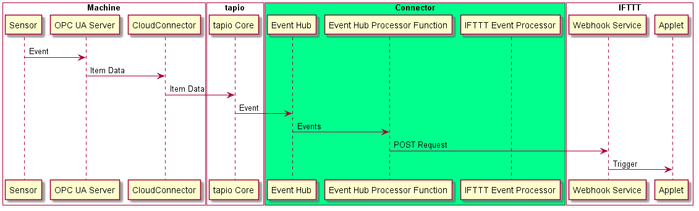
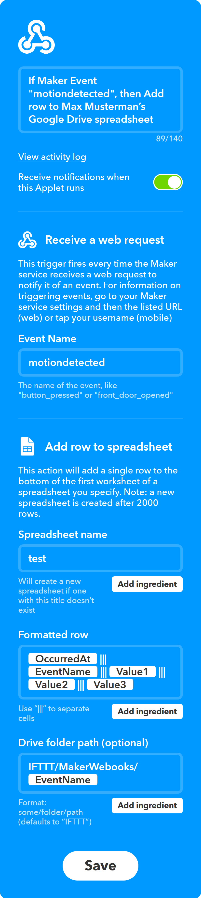

# Connecting the digital worlds (3/3)

In the [previous article][article_2] we implemented the flow of events from IFTTT to tapio-ready machines. Now we want to implement forwarding events from tapio-ready machines to IFTTT.

* [Connecting the digital worlds (1/3)][article_1]
* [Connecting the digital worlds (2/3)][article_2]
* [Connecting the digital worlds (3/3)][article_3]



First off we need a way to trigger an event on our demo machine. We decided to go with a [AM312](https://www.sunrom.com/p/micro-pir-motion-detection-sensor-am312) [PIR](https://en.wikipedia.org/wiki/Passive_infrared_sensor) motion sensor which can be directly connected to the demo machine through its [GPIO interface](https://www.raspberrypi.org/documentation/usage/gpio/). When properly connected to a ground pin, a voltage pin and a generic GPIO data pin it'll output a current on the GPIO pin on motion.

<!-- TODO insert wiring picture -->

Now that our sensor is ready we have to monitor it for status changes in order to react to motion events. Microsofts GPIO library [System.Device.Gpio](https://github.com/dotnet/iot) provides a method `RegisterCallbackForPinValueChangedEvent` through which one can subscribe to rising or falling currents. Using this method we wrote a little wrapper to simplify things a bit:

```csharp
public class MotionSensorMonitor : IMotionSensorMonitor
{
    private int _Pin;

    public event EventHandler OnMotion;

    public MotionSensorMonitor(int pinBoardNumber)
    {
        _Pin = pinBoardNumber;
        var controller = new GpioController(PinNumberingScheme.Board);
        controller.OpenPin(_Pin);
        controller.SetPinMode(_Pin, PinMode.Input);
        controller.RegisterCallbackForPinValueChangedEvent(_Pin, PinEventTypes.Rising, (sender, args) =>
        {
            OnMotion?.Invoke(this, new EventArgs());
        });
    }
}
```

Now that we're able to react to status changes we want them reflected in the OPC UA server of our demo machine so that these changes can get forwarded to tapio through the CloudConnector also running on our demo machine. So we have to a add a node to our OPC UA servers address space:

```csharp
protected override void CreateAddressSpace()
{
    base.CreateAddressSpace();

    _MotionSensorState = new DataVariableState<string>(false, "MotionSensorState", RootFolder, SystemContextObject);

    AddNode(_MotionSensorState);
}
```

Then we have to add an event handler method to our node manager which updates our `MotionSensorState` node when called:

```csharp
public void OnMotionDetected()
{
    if(_MotionSensorState == null)
    {
        throw new InvalidOperationException("Please create the base event state first");
    }
    _MotionSensorState.StatusChanged("Motion detected", StatusCodes.Good);
}
```

Finally we have to hook up the motion sensor monitor with our event handler method:

```csharp
static void Main(string[] args)
{
    var led = new Led(16, 20, 21);
    var ledController = new LedController(led);
    var motionSensorMonitor = new MotionSensorMonitor(10);
    var nodeManager = new NodeManager(ledController, motionSensorMonitor);
    var server = new Server(nodeManager);
    motionSensorMonitor.OnMotion += nodeManager.OnMotionDetected;
}
```

Now we're able to reflect motions in front of our PIR to OPC UA node status changes. CloudConnector can forward these status changes to tapio if we configure the data module of the CloudConnector [correctly](https://developer.tapio.one/docs/CloudConnector/DataModule.html#sourcedataitem). You can see our configuration below:

```xml
...
<SourceItem xsi:type="SourceDataItem">
  <NodeId>ns=2;s=PiSensorServer.MotionSensorState</NodeId>
  <SrcKey>MotionSensorState</SrcKey>
</SourceItem>
...
```

As tapio [supports](https://developer.tapio.one/docs/TapioDataCategories.html#streaming-data) streaming this data into an [Azure Event Hub](https://azure.microsoft.com/en-in/services/event-hubs/) we deployed us one through the [Azure Portal](http://portal.azure.com/) and configured an app in [my tapio](https://my.tapio.one/) to forward the data to our event hub.

Data ingested into an Azure Event Hub can easily be processed, stored or served for third party apps. As we only want to process and forward events as they come in we opted for a serverless approach [again][article_2] with another Azure Function hooked up to our event hub.

Below you can see how an event message ingested into our event hub looks like:

```json
{
  "tmid": "741ab3a2-040a-44bf-b8ce-4333d567a99a", // machine id
  "msgid": "bf8610fa-a5e9-4ede-ad37-51082e7eb372", // message id
  "msgt": "itd", // message type
  "msgts": "2017-06-29T10:39:03.7651013+01:00", // ISO8601 timestamp 
  "msg":  {
    "p": "pi", // provider name
    "k": "MotionSensorState", // key, usually the node id
    "vt": "s", // data value type (string)
    "v": "motion detected", // payload
    "q": "g", // quality of the value (OPC UA thing)
    "sts": "2017-06-29T10:38:43.7606016+01:00", // ISO8601 timestamp by OPC UA server
    "rts": "2017-06-29T10:38:53.7606016+01:00" // ISO8601 timestamp by CloudConnector
  }
}
```

[Streaming data](https://developer.tapio.one/docs/TapioDataCategories.html#streaming-data) messages from tapio received by our event hub can have different structures. We're only interested into [item data](https://developer.tapio.one/docs/TapioDataCategories.html#item-data) messages because we just want to monitor status changes of our PIR motion sensor monitor node. You can recognize an item data message if you take a look at the `msgt` (message type) property. Every item data message has the type `itd`.

Inside the `msg` property we can find the actual item data message.


Reads from eventhub and filters for messages from our pi

forwards events via http post request to ifttt webhook component

```csharp
[FunctionName("EventHubProcessorFunction")]
public static async void Run([IoTHubTrigger("ifttt", Connection = "EventHubConnection")]EventData message,
ILogger log, Microsoft.Azure.WebJobs.ExecutionContext context,
CancellationToken cancellationToken)
{
    log.LogInformation($"C# IoT Hub trigger function processed a message: {Encoding.UTF8.GetString(message.Body.Array)}");

    var eventHubMessage = JsonConvert.DeserializeObject<EventHubMessage>(Encoding.UTF8.GetString(message.Body.Array));
    if(eventHubMessage.MessageType != "itd")
    {
        log.Log(LogLevel.Debug, $"Ignoring non-ItemData streaming data: {Encoding.UTF8.GetString(message.Body.Array)}");
        return;
    }

    var tapioEvent = JsonConvert.DeserializeObject<TapioEvent>(JsonConvert.SerializeObject(eventHubMessage.Message));

    if (tapioEvent.Provider != "pi")
    {
        log.Log(LogLevel.Debug, $"Ignoring non-event related data: {Encoding.UTF8.GetString(message.Body.Array)}");
        return;
    }

    await SendEventToIFTTT(tapioEvent, log);

    log.Log(LogLevel.Information, $"Action was sent successfully.");
}
```

show off possible payloads and use cases

POST https://maker.ifttt.com/trigger/**motiondetected**/with/key/3Ef9eYIfe3tZIA8dcYcLUrQ3kIfd99SiszvYXIfegaM

```json
{
    "value1": "some string",
    "value2": "some other string",
    "value3": "and another string"
}
```

TODO: remove white edges


## Conclusion

<!-- Insert Architecture diagram -->

That's it! Two Azure Functions, an EventHub, a Raspberry Pi and three workdays later we're able to present a functioning prototype. For our demo on day four we logged motion sensor data through our connector into a Google Drive sheet, turned on a RGB LED with the press of a widget button on a smartphone and configured a new IFTTT-Applet live. We didn't develop a shippable product but built a working proof of concept which can be transformed into a proper solution. Authentication, authorization and a web interface for configuring events to be be forwarded on a per machine basis for example are tasks still to be done.

Aside from resolving the actual challenges the hackathon was most notably a fun event with awesome attendees who helped each other out at any time and had a great time together! :)

[article_1]: https://www.tapio.one/en/blog/connecting-the-digital-worlds-1-3
[article_2]: https://www.tapio.one/en/blog/connecting-the-digital-worlds-2-3
[article_3]: https://www.tapio.one/en/blog/connecting-the-digital-worlds-3-3
