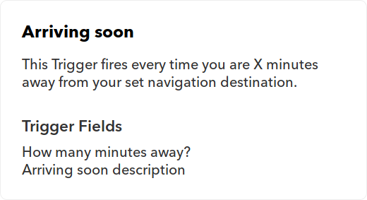
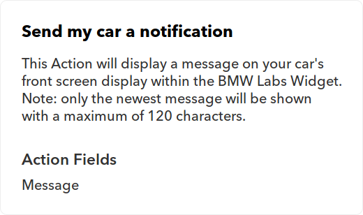

# Connecting the digital worlds

Hallo Welt! Als dualer HOMAG-Student nutzte ich die Gelegenheit, die HOMAG Digital Factory bei [#hackthewood2019](http://www.hackthewood.com) in Berlin zu vertreten. In diesem Artikel möchte ich zeigen, wie wir dort eine Idee in weniger als vier Tagen in einen funktionierenden Prototyp umgesetzt haben.

## Die Idee

Die Herausforderung, für die ich verantwortlich war - connecting the digital worlds - war die Umsetzung einer eher einfachen Idee: Die Verbindung des tapio-Ökosystems mit [IFTTT](https://ifttt.com/).

IFTTT or "**IF T**his **T**hen **T**hat" ist eine Internet-der-Dinge- und Automatisierungsplattform, die von jedem genutzt werden kann, auch ohne technische Vorkenntnisse. Wie der Name schon sagt, geht es um sehr einfache Automatisierungen, die man auf der Website oder der App von IFTTT zusammenklicken kann:

* **Wenn** ich einem Musikvideo auf YouTube einen Daumen nach oben gebe, **dann** dann füge es meiner Spotify-Bibliothek hinzu.
* **Wenn** mein Staubsaugerroboter irgendwo hängen geblieben ist, **dann** schicke mir eine Benachrichtigung auf mein Smartphone.

Wenn das tapio-Ökosystem mit IFTTT verbunden wäre, könnte ein Schreiner selbstständig individuelle Automatisierungen einrichten, wie z.B.:

* **Wenn** meine CNC Maschine einen Alarm ausgelöst hat, **dann** lasse die Beleuchtung um die Maschine herum rot pulsieren, dass ein Mitarbeiter auf den Alarm aufmerksam wird und sich darum kümmert.
* **Wenn** ich Amazon Alexa damit beauftrage meine Kantenmaschine anzuschalten, **dann** startet meine Kantenmaschine.

### Wie funktioniert IFTTT?

Bei IFTTT sind die Dinge sehr einfach gehalten.

Ein IFTTT-Service kann jede Art von digitaler Plattform wie YouTube, iRobot, Wordpress oder tapio sein. Nach einer erfolgreichen Integration in IFTTT besteht jeder Service jedoch nur noch aus einer Marke, Triggern und Aktionen.

Ein IFTTT-Trigger kann verwendet werden, um benachrichtigt zu werden, wenn ein Ereignis in seinem Ursprungsdienst eintritt. So bietet der BMW Labs Service beispielsweise unter anderen folgenden Trigger an:

Wie zu sehen ist, hat ein Trigger einen Namen, eine Beschreibung und eine Anzahl von Eigenschaften.

Eine IFTTT-Aktion hingegen kann verwendet werden, um etwas in ihrem Ursprungsdienst aufzurufen. Aktionen werden nach dem gleichen Muster wie Trigger erstellt, wie ein weiteres Beispiel aus dem BMW Labs Service zeigt:

Schließlich kann man einen Trigger auch mit einer anderen Aktion aus einem beliebigen Service kombinieren, was dann als IFTTT-Applet bezeichnet wird. Applets können auf [IFTTT.com](http://www.ifttt.com/discover) mit anderen geteilt werden. Ein Auszug:

## Die Implementierung

Am ersten Tag des Hackathons erstellten wir einen Implementierungsplan, bestehend aus kleineren Aufgaben. Die restliche Zeit bis zur Präsentation der Ergebnisse am vierten Tag verbrachten wir dann mit Programmieren, dem Lesen von Dokumentationen und Kopfkratzen.

Da die [offizielle Integration](https://platform.ifttt.com/docs) von tapio in IFTTT ein eigenständiges Projekt gewesen wäre und den Zugang zu tapio-internen Strukturen erfordert hätte, haben wir stattdessen einen IFTTT-Service namens [Webhooks](https://ifttt.com/maker_webhooks) genutzt um tapio mit IFTTT zu verbinden.

Es gibt keine offizielle Spezifikation zu Webhooks. Allgemein kann ein Webhook als Endpunkt für einen HTTP-Aufruf verstanden werden, welcher beim Aufruf eine beliebige Aktion anstößt. Der Webhooks IFTTT-Service bietet einen IFTTT-Trigger, welcher HTTP-Aufrufe empfangen kann, und eine IFTTT-Aktion, welche HTTP-Aufrufe senden kann. So kann der IFTTT-Service als Schnittstelle zum Einspeisen oder Empfangen von Ereignissen jeglicher Art verwendet werden.

Es gab also zwei Ereignisabläufe, welche wir implementieren mussten: Von tapio-ready Maschinen bis zu IFTTT und den Weg zurück.

### Die Testmaschine

Um während der Entwicklung des tapio-IFTTT-Connectors auch testen und später unsere Ergebnisse präsentieren zu können, benötigten wir eine Testmaschine, welche

* den tapio CloudConnector installiert hat,
* dazu in der Lage ist eine OPC UA Server Instanz auszuführen,
* einen Input hat, sodass wir Ereignisse auslösen können,
* und einen Output hat, damit wir das Empfangen eines Ereignisses darstellen können.

Der tapio CloudConnector ist die Software von tapio, welche auf einer Maschine installiert werden muss, damit sie sich mit dem tapio-Ökosystem verbinden kann. Der CloudConnector unterstützt ein Maschine-zu-Maschine-Kommunikationsprotokoll namens [OPC UA](https://opcfoundation.org/about/opc-technologies/opc-ua/), mit dem wir die Input- und Outputkomponenten der Testmaschine mit dem CloudConnector verbinden können.

Die erste Idee, die uns in den Sinn kam, war ein [Raspberry Pi](https://www.raspberrypi.org/) zu verwenden. Es ist preiswert, zuverlässig und einfach einzurichten. Es bietet außerdem eine GPIO-Schnittstelle, über die jede beliebige Input- und Outputkomponente wie z.B. ein Bewegungsmelder als Input und eine RGB-LED als Output angeschlossen werden kann.

Also organisierten wir uns ein Pi, installierten das Betriebssystem [Raspbian Lite](https://www.raspberrypi.org/downloads/raspbian/) und richteten einen SSH Zugang ein. Dann besuchten wir das [tapio Developer Portal](https://developer.tapio.one) um herauszufinden, wie der CloudConnector unter Linux installiert wird. Als der CloudConnector auf dem Pi schließlich lief, richteten wir uns noch [Remote Debugging mit Visual Studio Code](https://www.hanselman.com/blog/RemoteDebuggingWithVSCodeOnWindowsToARaspberryPiUsingNETCoreOnARM.aspx) ein. So war die Implementierung der Software, welche die Input- und Outputkomponenten mit dem OPC UA Server verband, wesentlich einfacher.
Um auf die GPIO Pins zuzugreifen benutzen wir die NuGet Pakete [Unosquare.RaspberryIO](https://github.com/unosquare/raspberryio) und [System.Device.Gpio](https://www.nuget.org/packages/System.Device.Gpio). Letzteres bot sogar die Möglichkeit, einen benutzerdefinierten Event-Handler für GPIO-Pin-Statusänderungen bereitzustellen, was den Umgang mit Sensor-Ereignissen um einiges vereinfachte.

### Der Connector

Von den zwei Routen für Ereignisse haben wir uns zuerst auf die Route von IFTTT zur Maschine fokussiert:

1. Ein IFTTT-Applet wird ausgelöst, welches dann über den Webhook IFTTT-Service den Connector aufruft.
2. Der Connector leitet das Ereignis über die tapio Commanding-API an die entsprechende CloudConnector Instanz weiter.
3. Der CloudConnector leitet das Ereignis an den vorkonfigurierten OPC UA Server weiter.
4. Der speziell angepasste OPC UA Server verarbeitet das Ereignis.

Die tapio Commanding-API wird normalerweise dazu verwendet, Werte von Knoten auf einem OPC UA Server zu ändern oder OPC UA Methoden aufzurufen. Wir nutzen die Eigenschaft der Commanding-API Werte von Knoten zu ändern um immer dann einen Wert zu ändern, wenn ein Ereignis übertragen werden sollte. Serverseitig mussten wir dann lediglich den Zustand eines Knoten überwachen und bei Änderung die übertragenen Daten als Ereignisdaten interpretieren. Im Detail benutzen wir einen `DataVariableState` vom Typ `String` und benutzen den Wert des Knoten um ein serialisiertes JSON Object zu übertragen, welches Metadaten zu dem Ereignis mit sich führte. Als wir feststellten, dass der Connector lediglich auf eine HTTP-Anfrage wartet und selbst eine HTTP-Anfrage stellt, entschieden wir uns für einen [Server-losen](https://martinfowler.com/articles/serverless.html) Ansatz mit einer [Azure Function](https://docs.microsoft.com/en-us/azure/azure-functions/), um Zeit zu sparen (Eine Azure Function ist im Grunde genommen ein Stück Code, welcher ausgeführt wird, wenn eine bestimmte Bedingung eintritt).

Zum Testen unserer Azure Function kam uns das Befehlszeilenprogramm [ngrok](https://ngrok.com/) gelegen. Mit ngrok kann ein lokaler Entwicklungsserver dem Internet zugänglich gemacht werden. Auf diese Weise können Webhooks debuggt werden, ohne manuell Ports freizuschalten oder einen extra Webserver zu mieten.

Nachdem der erste Ereignisablauf einmal erfolgreich durchlief, begannen wir mit der Arbeit am zweiten:

1. Ein Sensor einer Maschine hat seinen Zustand geändert.
2. Die Zustandsänderung wird an den OPC UA Server der Maschine weitergeleitet.
3. Der OPC UA Server löst ein OPC UA Ereignis aus.
4. Der CloudConnector leitet das Ereignis an den tapio Core weiter.
5. Der tapio Core leitete das Ereignis an einen benutzerdefinierten EventHub weiter (vorkonfiguriert für die tapio-Maschinen-ID).
6. Der Connector bekommt eine neue Nachricht vom EventHub.
7. Der Connector interpretiert die Nachricht als Ereignis und leitet dieses an IFTTT über den Webhook-Service weiter.
8. In IFTTT empfängt ein IFTTT-Applet das Ereignis und leitet es entsprechend seiner Konfiguration an einen beliebigen Dienst in IFTTT weiter.

Ein [Azure EventHub](https://azure.microsoft.com/en-us/services/event-hubs/) kann viele Ereignisse gleichzeitig verarbeiten und stellt eine Warteschlange bereit, über welche die einzelnen Ereignisse von verschiedenen Konsumenten nacheinander verarbeitet werden können.
Wir haben eine EventHub-Instanz in Azure eingerichtet und diese über [my tapio](https://admin.tapio.one/) mit unserer Testmaschine verbunden. Dann haben wir eine weitere Azure Function eingerichtet, welche Nachrichten aus dem EventHub ausliest, diese als Ereignisse interpretiert und über den Webhook-Service an IFTTT weiterleitet.

## Fazit

Das war 's! Zwei Azure Functions, ein EventHub, ein Raspberry Pi, ein paar Sensoren und drei Werktage später konnten wir einen funktionsfähigen Prototyp präsentieren. Für unsere Demo am vierten Tag haben wir die Daten eines Bewegungssensors an unserer Testmaschine über den tapio-IFTTT-Connector in eine Google Drive Tabelle protokolliert, eine RGB-LED mit einem Widget auf einem Smartphone eingeschaltet und ein neues IFTTT-Applet live konfiguriert. Wir haben kein fertiges Produkt entwickelt, aber einen funktionierenden Machbarkeitsnachweis geliefert, welcher in ein richtiges Produkt weiterentwickelt werden kann. Eine Form der Authentifizierung, Autorisierung und eine Weboberfläche zur Konfiguration von maschinenbezogenen Ereignissen stünden beispielsweise noch aus.

Neben der Bearbeitung der Herausforderungen war der Hackathon aber vor allem eine lustige Veranstaltung mit motivierten Teilnehmern, welche sich jederzeit gegenseitig ausgeholfen haben und gemeinsam eine spannende Woche in Berlin erlebt haben! :)
