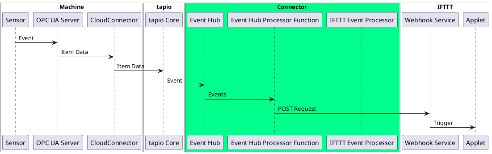

```plantuml
@startuml

box "Machine" #ffffff
    participant Sensor
    participant "OPC UA Server"
    participant CloudConnector
end box

box "tapio" #ffffff
    participant "tapio Core"
end box

box "Connector" #00ff8c
    participant "Event Hub"
    participant "Event Hub Processor Function"
    participant "IFTTT Event Processor"
end box

box "IFTTT" #ffffff
    participant "Webhook Service"
    participant Applet
end box

Sensor->"OPC UA Server" : Event
"OPC UA Server"->CloudConnector: Item Data
CloudConnector->"tapio Core" : Item Data
"tapio Core"->"Event Hub" : Event
"Event Hub"->"Event Hub Processor Function" : Events
"Event Hub Processor Function"->"Webhook Service" : POST Request
"Webhook Service"->Applet : Trigger

@enduml
```