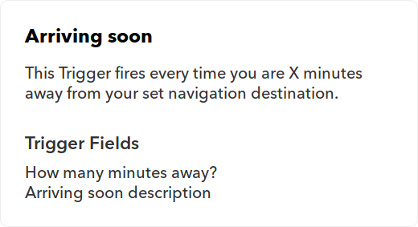

# Connecting the digital worlds (1/3)

Hallo Welt! Als dualer HOMAG-Student nutzte ich die Gelegenheit, die HOMAG Digital Factory bei [#hackthewood2019](https://www.tapio.one/de/blog/hack-the-wood-2019) in Berlin zu vertreten. In dieser Artikelserie möchte ich in drei Schritten zeigen, wie wir dort eine Idee in weniger als vier Tagen in einen funktionierenden Prototyp umgesetzt haben:

* [Connecting the digital worlds (1/3)][article_1]
* [Connecting the digital worlds (2/3)][article_2]
* [Connecting the digital worlds (3/3)][article_3]

## Die Idee

Die Herausforderung, für die ich verantwortlich war - connecting the digital worlds - war die Umsetzung einer einfachen Idee: Die Verbindung des tapio-Ökosystems mit [IFTTT](https://ifttt.com/).

IFTTT or "**IF T**his **T**hen **T**hat" ist eine Internet-der-Dinge- und Automatisierungsplattform, die von jedem genutzt werden kann, auch ohne technische Vorkenntnisse. Wie der Name schon sagt, geht es um sehr einfache Automatisierungen, die man auf der Website oder der App von IFTTT zusammenklicken kann:

* **Wenn** ich einem Musikvideo auf YouTube einen Daumen nach oben gebe, **dann** dann füge es meiner Spotify-Bibliothek hinzu.
* **Wenn** mein Staubsaugerroboter irgendwo hängen geblieben ist, **dann** schicke mir eine Benachrichtigung auf mein Smartphone.

Wenn das tapio-Ökosystem mit IFTTT verbunden wäre, könnte ein Schreiner selbstständig individuelle Automatisierungen einrichten, wie z.B.:

* **Wenn** meine CNC Maschine einen Alarm ausgelöst hat, **dann** lasse die Beleuchtung um die Maschine herum rot pulsieren, dass ein Mitarbeiter auf den Alarm aufmerksam wird und sich darum kümmert.
* **Wenn** ich Amazon Alexa damit beauftrage meine Kantenmaschine anzuschalten, **dann** startet meine Kantenmaschine.

### Wie funktioniert IFTTT?

Bei IFTTT sind die Dinge sehr einfach gehalten.

Ein IFTTT-Service kann jede Art von digitaler Plattform wie YouTube, iRobot, Wordpress oder tapio sein. Nach einer erfolgreichen Integration in IFTTT besteht jeder Service jedoch nur noch aus einer Marke, Triggern und Aktionen.

Ein IFTTT-Trigger benachrichtigt automatisch, wenn ein Ereignis in seinem Ursprungsdienst eintritt. So bietet der BMW Labs Service beispielsweise unter anderen folgenden Trigger an:

Wie zu sehen ist, hat ein Trigger einen Namen, eine Beschreibung und eine Anzahl von Eigenschaften.

Eine IFTTT-Aktion hingegen kann verwendet werden, um etwas in ihrem Ursprungsdienst aufzurufen. Aktionen werden nach dem gleichen Muster wie Trigger erstellt, wie ein weiteres Beispiel aus dem BMW Labs Service zeigt:

Schließlich kann man einen Trigger auch mit einer anderen Aktion aus einem beliebigen Service kombinieren, was dann als IFTTT-Applet bezeichnet wird. Applets können auf [IFTTT.com](http://www.ifttt.com/discover) mit anderen geteilt werden. Ein Auszug:

## Die Implementierung

Am ersten Tag des Hackathons erstellten wir einen Implementierungsplan, bestehend aus kleineren Aufgaben. Die restliche Zeit bis zur Präsentation der Ergebnisse am vierten Tag verbrachten wir dann mit Programmieren, dem Lesen von Dokumentationen und Kopfkratzen.

Da die [offizielle Integration](https://platform.ifttt.com/docs) von tapio in IFTTT ein eigenständiges Projekt gewesen wäre und den Zugang zu tapio-internen Strukturen erfordert hätte, haben wir stattdessen einen IFTTT-Service namens [Webhooks](https://ifttt.com/maker_webhooks) genutzt um tapio mit IFTTT zu verbinden.

Es gibt keine offizielle Spezifikation zu Webhooks. Allgemein kann ein Webhook als Endpunkt für einen HTTP-Aufruf verstanden werden, welcher beim Aufruf eine beliebige Aktion anstößt. Der Webhooks IFTTT-Service bietet einen IFTTT-Trigger, welcher HTTP-Aufrufe empfangen kann, und eine IFTTT-Aktion, welche HTTP-Aufrufe senden kann. So kann der IFTTT-Service als Schnittstelle zum Einspeisen oder Empfangen von Events jeglicher Art verwendet werden.

Es gab also zwei Routen für Events, welche wir implementieren mussten: Von tapio-ready Maschinen bis zu IFTTT und zurück: 

### Die Testmaschine

Um während der Entwicklung des tapio-IFTTT-Connectors auch testen und später unsere Ergebnisse präsentieren zu können, benötigten wir eine Testmaschine, welche

* den tapio CloudConnector installiert hat,
* dazu in der Lage ist eine OPC UA Server Instanz auszuführen,
* einen Input hat, sodass wir Events auslösen können,
* und einen Output hat, damit wir das Empfangen eines Events simulieren können.

Der tapio CloudConnector ist die Software von tapio, welche auf einer Maschine installiert werden muss, damit sie sich mit dem tapio-Ökosystem verbinden kann. Der CloudConnector unterstützt ein Maschine-zu-Maschine-Kommunikationsprotokoll namens [OPC UA](https://opcfoundation.org/about/opc-technologies/opc-ua/), mit dem wir die Input- und Outputkomponenten der Testmaschine mit dem CloudConnector verbinden können.

Die erste Idee, die uns in den Sinn kam, war ein [Raspberry Pi](https://www.raspberrypi.org/) zu verwenden. Es ist preiswert, zuverlässig und einfach einzurichten. Es bietet außerdem eine GPIO-Schnittstelle, über die jede beliebige Input- und Outputkomponente wie z.B. ein Bewegungsmelder als Input und eine RGB-LED als Output angeschlossen werden kann.

Also organisierten wir uns ein Pi, installierten das Betriebssystem [Raspbian Lite](https://www.raspberrypi.org/downloads/raspbian/) und richteten einen SSH Zugang ein. Dann suchten wir das [tapio Developer Portal](https://developer.tapio.one) auf um herauszufinden, wie der CloudConnector unter Linux installiert wird. Als der CloudConnector auf dem Pi schließlich lief, richteten wir uns noch [Remote Debugging mit Visual Studio Code](https://www.hanselman.com/blog/RemoteDebuggingWithVSCodeOnWindowsToARaspberryPiUsingNETCoreOnARM.aspx) ein. So war die Implementierung der Software, welche die Input- und Outputkomponenten mit dem OPC UA Server verband, wesentlich einfacher.

Mit der Inbetriebnahme unserer Testmaschine begannen wir mit der Implementierung des tapio-IFTTT-Connectors. Im [nächsten Artikel][article_2] dieser Serie werden wir uns mit der Implementierung der Route von Events von IFTTT zu tapio-ready Maschinen beschäftigen.

[article_1]: https://www.tapio.one/de/blog/connecting-the-digital-worlds-1-3
[article_2]: https://www.tapio.one/de/blog/connecting-the-digital-worlds-2-3
[article_3]: https://www.tapio.one/de/blog/connecting-the-digital-worlds-3-3
