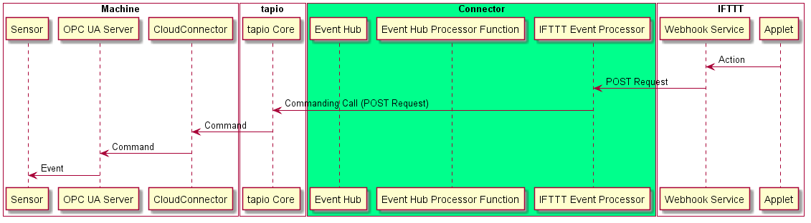

# Connecting the digital worlds (2/3)

Im[vorherigen Artikel][article_1] haben wir die Idee der Challenge erklärt und eine Testmaschine eingerichtet. In diesem Artikel nehmen wir uns die Implementierung der ersten Route für Events im tapio-IFTTTT-Connector vor: Von IFTTTT bis hin zu tapio-ready Maschinen.

* [Connecting the digital worlds (1/3)][article_1]
* [Connecting the digital worlds (2/3)][article_2]
* [Connecting the digital worlds (3/3)][article_3]



Wie [bereits erwähnt][article_1], möchten wir den IFTTT Webhook-Dienst verwenden, so dass wir beim Auslösen eines Applets, welches den Webhook-Dienst verwendet, eine HTTP-Request an dem im Applet angegebenen Endpunkt senden. Diese Request wollen wir dann verarbeiten und das Event über die [tapios Commanding API](https://developer.tapio.one/docs/Commanding.html) an die Maschine weiterleiten. Die Commanding-API wird typischerweise verwendet, um mit [OPC UA](https://opcfoundation.org/about/opc-technologies/opc-ua/)-Servern zu interagieren, welche auf tapio-ready Maschinen laufen.

Als wir feststellten, dass unser tapio-IFTTTT-Connector lediglich eine HTTP-Request empfangen, dann verarbeiten und schließlich eine weitere HTTP-Request stellen muss, haben wir uns für einen [serverlosen Implementierungsansatz][(https://martinfowler.com/articles/serverless.html)] entschieden. Wie man am Namen erkennen kann, gibt es in einer serverlosen Architektur keine Server, sondern Codeschnipsel, die nur unter bestimmten Bedingungen ausgeführt werden. Natürlich laufen diese Codeschnipsel immer noch auf einem Server, aber nicht eigenen. Auf diese Weise können wir Geld sparen, weil wir keinen Server rund um die Uhr betreiben oder mieten müssen und uns außerdem keine Gedanken um die Einrichtung eines Servers, die Installation einer Laufzeitumgebung usw. machen müssen. Für die Implementierung von serverlosen Architekturen stehen mehrere Produkte zur Verfügung. Wir haben uns für [Azure Functions](https://azure.microsoft.com/de-de/services/functions/) von Microsofts Cloud-Plattform Azure entschieden.

Nach den ersten Zeilen Code, entstand recht schnell der Wunsch nach einer Möglichkeit unsere Azure Function zu debuggen. Wie also debuggt man eine Azure Function? Man kann nicht einfach eine Debugging-Session zu einer Azure Function in der Cloud aufbauen. Stattdessen müssen wir die Azure Function lokal ausführen und die HTTP-Requests von IFTTT an unseren lokalen Rechner weiterleiten. Hier war uns [ngrok](https://ngrok.com/) sehr nützlich.

Mit [ngrok](https://ngrok.com/) können wir einen lokalen Server hinter einem NAT oder einer Firewall dem Internet und damit IFTTT zugänglich machen und zwar ganz einfach:

Zuerst müssen wir uns auf [ngrok.com](https://ngrok.com/) registrieren, dann das Programm herunterladen und uns schließlich einen Authentifizierungs-Token erstellen. Dazu `ein_token` in dem Befehl unten mit dem Token ersetzten, der auf [ngrok.com](https://ngrok.com/) für unseren Account bereit gestellt wird.

```powershell
PS C:\Program Files\ngrok> ./ngrok authtoken ein_token
Authtoken saved to configuration file: C:\Users\Simon/.ngrok2/ngrok.yml   
```

Jetzt sind wir dazu in der Lage eine lokale Anwendung mit einer ngrok URL dem Internet zugänglich zu machen. Im folgenden Beispiel geben wir unsere lokal auf Port 1337 laufende Azure Function frei:

```powershell
PS C:\Program Files\ngrok> ./ngrok http 1337
```

Nachdem wir den obigen Befehl ausgeführt haben wird uns der aktuelle Zustand von unserem ngrok-Tunnel ausgegeben. Hinter `Forwarding` sieht man aktive Tunnel. In unserem Beispiel unten wird unsere lokale Azure Function unter der URL `http://qyt7q40w03.ngrok.io` dem Internet zugänglich gemacht. Wir können überprüfen, ob alles korrekt funktioniert, indem wir die ngrok URL in unserem Webbrowser öffnen, wobei wir eine GET-Request an unsere Azure Function senden. Wir wir sehen können wurde eine GET Request aufgezeichnet, der ngrok-Tunnel funktioniert also! Wenn wir uns die übermittelten Requests genauer anschauen wollen können wir auch das ngrok Webinterface unter `localhost:4040` aufrufen.

```shell
ngrok by @inconshreveable                               (Ctrl+C to quit)

Session Status      online
Account             (Plan: Free)
Version             2.3.30
Region              United States (us)
Web Interface       http://127.0.0.1:4040
Forwarding          http://qyt7q40w03.ngrok.io -> http://localhost:1337
Forwarding          https://qyt7q40w03.ngrok.io -> http://localhost:1337

Connections         ttl     opn     rt1     rt5     p50     p90
                    2       0       0.01    0.01    2.31    2.31

HTTP Requests
-------------

GET /WebhookProcessorFunction               200 OK
```

Um tatsächlich mit echten HTTP-Requests von IFTTT zu entwickeln und zu debuggen, müssen wir ein Applet mit einem Trigger unter unserer Kontrolle und einer Aktion erstellen, die HTTP-Requests an unsere lokale Azure Function sendet, die durch ngrok freigegeben wird. Deshalb erstellen wir ein Applet, das eine POST-Request in unseren ngrok-Tunnel sendet, wenn wir auf unserem Smartphone einen Widget-Button drücken:


Aufgrund unseres begrenzten Zeitrahmens haben wir uns dazu entschieden lediglich eine Request mit Klartext-Body mit einem einfachen Event-Namen zu schicken, um die Komplexität zu reduzieren. Später könnte man jedoch auch ganze JSON-Objekte übertragen.

Nun zum spaßigen Teil: Die Implementierung der Azure Function. Der folgende Code wartet im Wesentlichen auf GET- oder POST-Requests, analysiert dann den Body der Request, interpretiert ihn als Event und leitet ihn dann über die Commanding API an unsere Testmaschine weiter.

Die Commanding API wird normalerweise verwendet, um Werte oder Methoden von Knoten auf einem OPC UA-Server zu ändern, der dem CloudConnector einer Maschine zugeordnet ist, aber wir dachten uns, dass wir auch die einfache Wertänderung eines Knoten verwenden können, um ein Event zu übertragen. Auf der OPC UA Server Seite müssen wir dann nur noch auf eine Änderung des Knoten-Zustandes warten und diese als Event interpretieren.

```csharp
[FunctionName("WebhookProcessorFunction")]
public static async Task<IActionResult> Run(
    [HttpTrigger(AuthorizationLevel.Function, "get", "post", Route = null)] HttpRequest req, Microsoft.Azure.WebJobs.ExecutionContext context, CancellationToken cancellationToken)
{
    var eventName = await new StreamReader(req.Body).ReadToEndAsync();
    var processedEvent = JsonConvert.SerializeObject(EventFactory.Create(eventName));

    await CallCommandAsync(new Command
    {
        CommandType = "itemWrite",
        Id = "ProcessEvent",
        ServerId = Config["ServerId"],
        TapioMachineId = Config["TapioMachineId"],
        Arguments = new Dictionary<string, CommandArgument>
        {
            { "value", new CommandArgument
                {
                 Value = processedEvent , ValueType = "String"
                }
            }
        }
    }, cancellationToken);

    return new OkObjectResult("The command was processed successfully");
}
```

Die `EventFactory`-Klasse ist dafür verantwortlich IFTTT-Event-Daten in unsere selbst definierte generische Event-Klasse umzuwandeln:

```csharp
public class Event
{
    [JsonProperty("name")]
    public string Name { get; set; }
    [JsonProperty("payload")]
    public string Payload { get; set; }
}
```

Aus Zeitgründen haben wir die Unterstützung von Events mit beliebigen Eigenschaften nicht implementiert. Events mit beliebigen Eigenschaften übertragen zu können würde es ermöglichen komplexe Anweisungen,[wie z.B. diese :)](https://www.youtube.com/watch?v=lx_vWkv50uk), an Maschinen zu übertragen.

Wenn wir jetzt versuchen würden unser System zu testen, würden Events ihre Zielmaschine nicht erreichen, weil wir die XML-Konfiguration des tapio CloudConnectors noch nicht angepasst haben. Standardmäßig können wir aus Sicherheitsgründen nicht auf einen OPC UA Knoten über die Commanding API zugreifen, bis wir den Zugriff in der Konfigurationsdatei einrichten.

In dem Beispiel unten erweitern wir die Konfiguration des `DataModule01` um die Konfiguration unseres Event-verarbeitenden OPC UA Servers `SensorServer`, welche wiederum einen Schreib-Befehl `ProcessEvent` für einen Knoten konfiguriert:

```xml
...
<Module xsi:type="DataModuleConfig">
      <Id>DataModule01</Id>
      <Source>
        <Servers>
          ...
          <SourceBase xsi:type="SourceOpcUa">
            <Id>SensorServer</Id>
            <OpcServer>opc.tcp://localhost:420</OpcUaServer>
            <Commanding>
              <Commands>
                  ...
                  <Command xsi:type="CommandItemWrite">
                    <Id>ProcessEvent</Id>
                    <TapioMachineId>741ab3a2-040a-44bf-b8ce-4333d567a99a</TapioMachineId>
                    <NodeId>ns=2;s=PiSensorServer.ProcessEventCommandState</NodeId>
                  </Command>
                  ...
                </Commands>
            </Commanding>
            <Groups>
          </SourceBase>
          ...
        </Servers>
      </Source>
</Module>
...
```

Jetzt sind wir fast startklar. Events werden nun an den OPC UA Server weitergeleitet, welcher auf unserer Testmaschine läuft. Aber diesem Server fehlt noch der konfigurierte Knoten und die dahinter stehende Logik.

Also fügen wir einen `DataVariableState` Knoten vom Typ `String` dem Adressraum unseres OPC UA Servers hinzu. Um eingehende Events verarbeiten zu können, müssen wir nun auf jede einzelne Statusänderung des Knotens reagieren können. Wir haben das implementiert, indem wir einen benutzerdefinierten Event-Handler an das Event `WriteCalled` unseres Knotens angehängt haben:

```csharp
protected override void CreateAddressSpace()
{
    base.CreateAddressSpace();

    _ProcessEventCommandDataVariableState = new DataVariableState(false, "ProcessEventCommandState", RootFolder, SystemContextObject, typeof(string));
    _ProcessEventCommandDataVariableState.WriteCalled += OnProcessEventCommandWrite;

    AddNode(_ProcessEventCommandDataVariableState);
}
```

Um physisch zu zeigen, dass unsere Testmaschine ein Event erhalten hat, möchten wir die an unserer Testmaschine angebrachte LED auf verschiedene Weise blinken lassen. Dafür müssen wir eine Abstraktionsschicht implementieren, um die LED anzusteuern, die über die GPIO-Schnittstelle unserer Testmaschine angeschlossen ist.

Also definieren wir eine Schnittstelle für die LED, um die GPIO-Logik zu abstrahieren, und eine weitere für einen LED-Controller, der zusätzlich in der Lage ist, Lichtsequenzen zu verarbeiten:

```csharp
public interface ILedController
{
    Task ProcessSequence(LedSequence ledSequence);

    void SetColor(int red, int green, int blue);
}

public interface ILed
{
    void SetColor(int red, int green, int blue);
}
```

Dann müssen wir noch die LED-Schnittstelle mit dem NuGet-Paket [Unosquare.RaspberryIO](https://github.com/unosquare/raspberryio) implementieren:

```csharp
public class Led : ILed
{
    private const int _MaxColorValue = 255;

    private GpioPin _RedPin;
    private GpioPin _BluePin;
    private GpioPin _GreenPin;

    public Led(int redBcm, int greenBcm, int blueBcm)
    {
        Pi.Init<BootstrapWiringPi>();
        _RedPin = InitializeGpioPin(redBcm);
        _GreenPin = InitializeGpioPin(greenBcm);
        _BluePin = InitializeGpioPin(blueBcm);
    }

    public void SetColor(int red, int green, int blue)
    {
        CheckColorRange(red, nameof(red));
        CheckColorRange(green, nameof(green));
        CheckColorRange(blue, nameof(blue));

        _RedPin.SoftPwmValue = (int) red / _MaxColorValue * 100;
        _GreenPin.SoftPwmValue = (int) green / _MaxColorValue * 100;
        _BluePin.SoftPwmValue = (int) blue / _MaxColorValue * 100;
    }

    private GpioPin InitializeGpioPin(int bcm)
    {
        var pin = (GpioPin)Pi.Gpio[bcm];
        pin.PinMode = GpioPinDriveMode.Output;
        pin.StartSoftPwm(1, _MaxColorValue);
        pin.SoftPwmValue = 0;
        return pin;
    }

    private void CheckColorRange(int color, string paramName)
    {
        if(color < 0 || color > _MaxColorValue)
        {
            throw new ArgumentException($"Color value ({color}) out of accepted range (0..{_MaxColorValue}).", paramName);
        }
    }
}
```

Jetzt sind wir endlich in der Lage, Events in unserem Eventhandler zu verarbeiten, indem wir den neuen Wert des Knotens als Event interpretieren und je nach Name des Events anders handeln. Dieser Teil wäre natürlich in einer ausgefeilten Version des tapio-IFTTTT-Connectors voll dynamisch und könnte Events verschiedenster Art verarbeiten.

```csharp
private void OnProcessEventCommandWrite(object sender, ValueWriteEventArgs e)
{
    Console.WriteLine($"Command received with arg: {e?.Value}");

    var eventData = JsonConvert.DeserializeObject<Event>(e.Value.ToString());
    
    try
    {
        switch (eventData?.Name)
        {
            case "light_on":
                _LedController.SetColor(255, 255, 255);
                break;
            case "light_off":
                _LedController.SetColor(0, 0, 0);
                break;
            // case "light_sequence":
            //     _LedController.ProcessSequence(JsonConvert.DeserializeObject<LedSequence>(eventData?.Payload));
            //     break;
            default:
                Console.WriteLine("Could not detect event type. Ignoring event.");
                break;
        }
    }
    catch (Exception)
    {
        Console.WriteLine("Processing event failed. Ignoring event.");
    }
}
```

Wir sind fertig!

Wir sind nun in der Lage, Events aus IFTTT mit nur einer Azure Function und einem OPC UA-Server zu verarbeiten! Im [nächsten Artikel][article_3] dieser Serie betrachten wir die Implementierung der umgekehrten Route: Events von einer tapio-ready Maschine an IFTTT weiterzuleiten.

[article_1]: https://www.tapio.one/de/blog/connecting-the-digital-worlds-1-3
[article_2]: https://www.tapio.one/de/blog/connecting-the-digital-worlds-2-3
[article_3]: https://www.tapio.one/de/blog/connecting-the-digital-worlds-3-3
