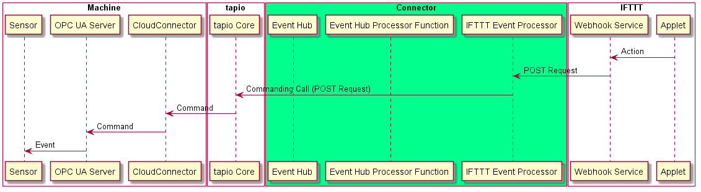
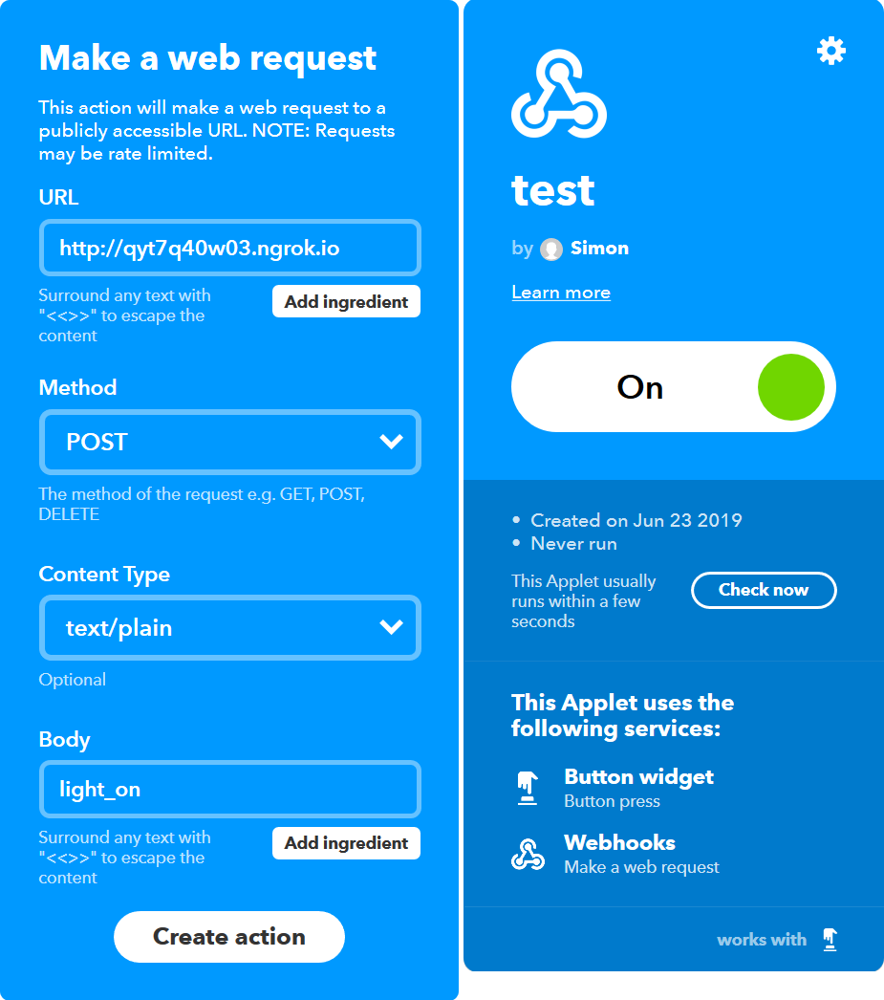

# Connecting the digital worlds (2/3)

In the [previous article][article_1] we clarified the idea of the challenge and set up a demo machine. In this article we take on the implementation of the first route of events in the tapio-IFTTT-Connector: From IFTTT to tapio-ready machines.

* [Connecting the digital worlds (1/3)][article_1]
* [Connecting the digital worlds (2/3)][article_2]
* [Connecting the digital worlds (3/3)][article_3]



As [previously specified][article_1] we want to use the IFTTT Webhook service so that when an applet using the Webhook service is triggered we will receive a HTTP request at the endpoint specified in the applet. We then want to process the request and forward the event to the machine using [tapios Commanding API](https://developer.tapio.one/docs/Commanding.html). The Commanding API is typically used to interact with [OPC UA](https://opcfoundation.org/about/opc-technologies/opc-ua/) servers running on tapio-ready machines.

When we recognized that our tapio-IFTTT-Connector simply has to receive a HTTP request, then process it and finally make another HTTP request we opted for a [serverless](https://martinfowler.com/articles/serverless.html) implementation approach. As you can tell by its name there are no servers in a serverless architecture but rather snippets of code which execute on certain conditions. Of course these snippets still run on a server but not on our servers. This way we can safe money because we don't have to operate or rent a server 24/7 and in addition we don't have to worry about setting up a server, installing a runtime environment etc. There are multiple products available for implementing serverless architectures. We picked Azure Functions from Microsofts cloud platform Azure.

When we started coding the desire for proper debugging arised rather quickly. So how does one debug an Azure Function? You can't simply establish a debugging session to your deployed function. Instead you have to run the Azure Function locally and forward the HTTP requests from IFTTT to your local machine and this is where [ngrok](https://ngrok.com/) came in handy.

With [ngrok](https://ngrok.com/) you're able to expose a local server behind a NAT or firewall to the internet and therefore IFTTT and it's dead simple:

You only have to register on [ngrok.com](https://ngrok.com/), download the executable and create yourself an `auth token` (replace `some_token` with the key provided for your account on [ngrok.com](https://ngrok.com/)).

```powershell
PS C:\Program Files\ngrok> ./ngrok authtoken some_token
Authtoken saved to configuration file: C:\Users\Simon/.ngrok2/ngrok.yml   
```

Now you're already able to expose a local port. In the example below we're exposing the local port our Azure Function is using:

```powershell
PS C:\Program Files\ngrok> ./ngrok http 1337
```

After running the above you're given a monitor screen in your terminal. Behind the `Forwarding` keyword you can see active tunnels. In our example below our local Azure Function is now exposed behind `http://qyt7q40w03.ngrok.io`. You can verify if everything is working correctly by opening the ngrok  URL in your web browser (sending a GET request). As you can see at the bottom of the output a GET request was logged as expected. It works! If you'd like to have a deeper look in incoming requests you can explore ngroks web interface running locally on port `4040`.

```shell
ngrok by @inconshreveable                               (Ctrl+C to quit)

Session Status      online
Account             (Plan: Free)
Version             2.3.30
Region              United States (us)
Web Interface       http://127.0.0.1:4040
Forwarding          http://qyt7q40w03.ngrok.io -> http://localhost:1337
Forwarding          https://qyt7q40w03.ngrok.io -> http://localhost:1337

Connections         ttl     opn     rt1     rt5     p50     p90
                    2       0       0.01    0.01    2.31    2.31

HTTP Requests
-------------

GET /WebhookProcessorFunction               200 OK
```

To actually develop and debug with real HTTP requests from IFTTT we have to create an applet with a trigger under our control and an action which sends HTTP requests to our local Azure Function exposed through ngrok. Therefore we create an applet which sends a POST request into our ngrok tunnel when we press a button on our smartphone:



Because of our limited time frame to create everything we opted for a plain text body with a simple event name to lower complexity. Further down the line one could however transmit full blown JSON objects.

Now for the good stuff: The implementation of the Azure Function. The code below basically waits for GET or POST requests, parses the body of the request, interprets it as event and then forwards it to the machine using the Commanding API.

The Commanding API is normally used to alter item values or call methods on a OPC UA server associated with the CloudConnector but we figured we can use an item write request as well to transmit an event. On OPC UA server side we then just have to wait for item state changes and interpret them as events.

```csharp
[FunctionName("WebhookProcessorFunction")]
public static async Task<IActionResult> Run(
    [HttpTrigger(AuthorizationLevel.Function, "get", "post", Route = null)] HttpRequest req, Microsoft.Azure.WebJobs.ExecutionContext context, CancellationToken cancellationToken)
{
    var eventName = await new StreamReader(req.Body).ReadToEndAsync();
    var processedEvent = JsonConvert.SerializeObject(EventFactory.Create(eventName));

    await CallCommandAsync(new Command
    {
        CommandType = "itemWrite",
        Id = "ProcessEvent",
        ServerId = Config["ServerId"],
        TapioMachineId = Config["TapioMachineId"],
        Arguments = new Dictionary<string, CommandArgument>
        {
            { "value", new CommandArgument
                {
                 Value = processedEvent , ValueType = "String"
                }
            }
        }
    }, cancellationToken);

    return new OkObjectResult("The command was processed successfully");
}
```

The `EventFactory` class is responsible for mapping event data from IFTTT to our generic event model:

```csharp
public class Event
{
    [JsonProperty("name")]
    public string Name { get; set; }
    [JsonProperty("payload")]
    public string Payload { get; set; }
}
```

Due to time constraints we didn't finish the implementation of the support for events with payload. However being able to transmit any payload would for example enable an IFTTT user to transmit complex statements like [these :)](https://www.youtube.com/watch?v=lx_vWkv50uk) to his machine.

If we tried to test our system at this point events wouldn't reach their target machine because we didn't modify the tapio CloudConnector XML configuration of the machine yet. By default  you can't access any OPC UA node through Commanding API for security reasons until you configure the access in the configuration file.

In the example below we extend the configuration of `DataModule01` with our OPC UA event processor server `SensorServer` which has an item write command configured: `ProcessEvent`.

```xml
...
<Module xsi:type="DataModuleConfig">
      <Id>DataModule01</Id>
      <Source>
        <Servers>
          ...
          <SourceBase xsi:type="SourceOpcUa">
            <Id>SensorServer</Id>
            <OpcServer>opc.tcp://localhost:420</OpcUaServer>
            <Commanding>
              <Commands>
                  ...
                  <Command xsi:type="CommandItemWrite">
                    <Id>ProcessEvent</Id>
                    <TapioMachineId>741ab3a2-040a-44bf-b8ce-4333d567a99a</TapioMachineId>
                    <NodeId>ns=2;s=PiSensorServer.ProcessEventCommandState</NodeId>
                  </Command>
                  ...
                </Commands>
            </Commanding>
            <Groups>
          </SourceBase>
          ...
        </Servers>
      </Source>
</Module>
...
```

Now we're almost good to go. Events will now be forwarded to the OPC UA server running on our demo machine. But this server still lacks the configured node and the logic behind it.

So lets add a `DataVariableState` node of type `String` to the address space of our OPC UA server. To also be able to process incoming events we have to be able to react to every single status change. We implemented that by attaching a custom event handler to the `WriteCalled` event of our node:

```csharp
protected override void CreateAddressSpace()
{
    base.CreateAddressSpace();

    _ProcessEventCommandDataVariableState = new DataVariableState(false, "ProcessEventCommandState", RootFolder, SystemContextObject, typeof(string));
    _ProcessEventCommandDataVariableState.WriteCalled += OnProcessEventCommandWrite;

    AddNode(_ProcessEventCommandDataVariableState);
}
```

In order to physically show that our demo machine has received an event we want to flash the LED attached to our demo machine in different ways. Therefore we have to implement an abstraction layer to control the LED connected through the GPIO interface of our demo machine.

So we have to define an interface for a LED to abstract the GPIO logic and create another one for a LED controller which is additionally capable of processing light sequences:

```csharp
public interface ILedController
{
    Task ProcessSequence(LedSequence ledSequence);

    void SetColor(int red, int green, int blue);
}

public interface ILed
{
    void SetColor(int red, int green, int blue);
}
```

Now we have to implement the LED interface using the [Unosquare.RaspberryIO](https://github.com/unosquare/raspberryio) NuGet package:

```csharp
public class Led : ILed
{
    private const int _MaxColorValue = 255;

    private GpioPin _RedPin;
    private GpioPin _BluePin;
    private GpioPin _GreenPin;

    public Led(int redBcm, int greenBcm, int blueBcm)
    {
        Pi.Init<BootstrapWiringPi>();
        _RedPin = InitializeGpioPin(redBcm);
        _GreenPin = InitializeGpioPin(greenBcm);
        _BluePin = InitializeGpioPin(blueBcm);
    }

    public void SetColor(int red, int green, int blue)
    {
        CheckColorRange(red, nameof(red));
        CheckColorRange(green, nameof(green));
        CheckColorRange(blue, nameof(blue));

        _RedPin.SoftPwmValue = (int) red / _MaxColorValue * 100;
        _GreenPin.SoftPwmValue = (int) green / _MaxColorValue * 100;
        _BluePin.SoftPwmValue = (int) blue / _MaxColorValue * 100;
    }

    private GpioPin InitializeGpioPin(int bcm)
    {
        var pin = (GpioPin)Pi.Gpio[bcm];
        pin.PinMode = GpioPinDriveMode.Output;
        pin.StartSoftPwm(1, _MaxColorValue);
        pin.SoftPwmValue = 0;
        return pin;
    }

    private void CheckColorRange(int color, string paramName)
    {
        if(color < 0 || color > _MaxColorValue)
        {
            throw new ArgumentException($"Color value ({color}) out of accepted range (0..{_MaxColorValue}).", paramName);
        }
    }
}
```

Now we're finally able to process events in our event handler by interpreting the new value of the node as event and acting differently based on the name of the event. This part would naturally be fully dynamic and the sequence processor would work in a proper version of the tapio-IFTTT-Connector which wasn't implemented in two days.

```csharp
private void OnProcessEventCommandWrite(object sender, ValueWriteEventArgs e)
{
    Console.WriteLine($"Command received with arg: {e?.Value}");

    var eventData = JsonConvert.DeserializeObject<Event>(e.Value.ToString());
    
    try
    {
        switch (eventData?.Name)
        {
            case "light_on":
                _LedController.SetColor(255, 255, 255);
                break;
            case "light_off":
                _LedController.SetColor(0, 0, 0);
                break;
            // case "light_sequence":
            //     _LedController.ProcessSequence(JsonConvert.DeserializeObject<LedSequence>(eventData?.Payload));
            //     break;
            default:
                Console.WriteLine("Could not detect event type. Ignoring event.");
                break;
        }
    }
    catch (Exception)
    {
        Console.WriteLine("Processing event failed. Ignoring event.");
    }
}
```

We're done! We're now able to process events coming from IFTTT using just one Azure Function and a OPC UA server. In the [next article][article_3] in this series we're looking at the implementation of the reversed route: Forwarding a event from a tapio-ready machine to IFTTT.

[article_1]: https://www.tapio.one/en/blog/connecting-the-digital-worlds-1-3
[article_2]: https://www.tapio.one/en/blog/connecting-the-digital-worlds-2-3
[article_3]: https://www.tapio.one/en/blog/connecting-the-digital-worlds-3-3
