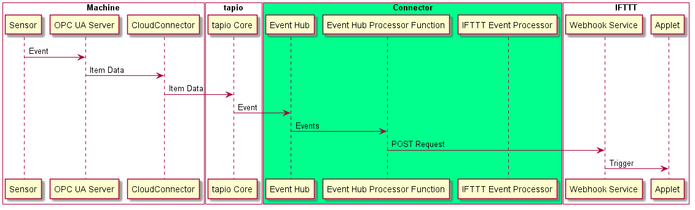
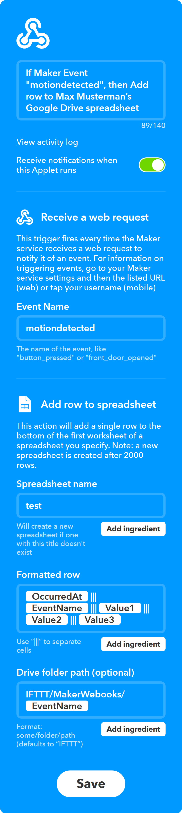

# Connecting the digital worlds (3/3)   

Im [vorherigen Artikel][article_2] haben wir den Weg von Events von IFTTT zu tapio-ready Maschinen implementiert. Jetzt wollen wir den umgekehrten Weg, von tapio-ready Maschinen zu IFTTT implementieren.

* [Connecting the digital worlds (1/3)][article_1]
* [Connecting the digital worlds (2/3)][article_2]
* [Connecting the digital worlds (3/3)][article_3]



Zuerst brauchen wir eine Möglichkeit, ein Event auf unserer Demo-Maschine auszulösen. Wir haben uns für einen [AM312](https://www.sunrom.com/p/micro-pir-motion-detection-sensor-am312) [PIR](https://en.wikipedia.org/wiki/Passive_infrared_sensor)-Bewegungsmelder entschieden, der über die [GPIO-Schnittstelle](https://www.raspberrypi.org/documentation/usage/gpio/) direkt mit unserer Demo-Maschine verbunden werden kann. Wenn er ordnungsgemäß mit einem Erdungspin, einem Spannungspin und einem generischen GPIO-Datenpin verbunden ist, gibt er einen Strom auf dem GPIO-Pin aus, wenn vor dem Sensor eine Bewegung stattfindet.

Nachdem unser Sensor nun bereit ist, müssen wir ihn auf Statusänderungen überwachen, um auf Bewegungs-Events reagieren zu können. Microsofts GPIO-Bibliothek [System.Device.Gpio](https://github.com/dotnet/iot) stellt eine Methode `RegisterCallbackForPinValueChangedEvent` zur Verfügung, mit welcher man einen Callback für steigende oder fallende Ströme registrieren kann. Mit Hilfe dieser Methode haben wir uns einen kleinen Wrapper geschrieben, um die Dinge ein wenig zu vereinfachen:

```csharp
public class MotionSensorMonitor : IMotionSensorMonitor
{
    private int _Pin;

    public event EventHandler OnMotion;

    public MotionSensorMonitor(int pinBoardNumber)
    {
        _Pin = pinBoardNumber;
        var controller = new GpioController(PinNumberingScheme.Board);
        controller.OpenPin(_Pin);
        controller.SetPinMode(_Pin, PinMode.Input);
        controller.RegisterCallbackForPinValueChangedEvent(_Pin, PinEventTypes.Rising, (sender, args) =>
        {
            OnMotion?.Invoke(this, new EventArgs());
        });
    }
}
```

Nachdem wir nun in der Lage sind, auf Statusänderungen zu reagieren, möchten wir, dass diese im OPC UA Server unserer Demo-Maschine als Werte eines Knoten wiedergespiegelt werden, so dass die Events dann über den tapio CloudConnector, der auch auf unserer Demo-Maschine läuft, an tapio weitergeleitet werden können. Also müssen wir dem Adressraum unseres OPC UA Servers einen Knoten hinzufügen:

```csharp
protected override void CreateAddressSpace()
{
    base.CreateAddressSpace();

    _MotionSensorState = new DataVariableState<string>(false, "MotionSensorState", RootFolder, SystemContextObject);

    AddNode(_MotionSensorState);
}
```

Dann müssen wir unserem Knotenmanager eine Methode hinzufügen, welche unseren `MotionSensorState` Knoten aktualisieren kann:

```csharp
public void OnMotionDetected()
{
    if(_MotionSensorState == null)
    {
        throw new InvalidOperationException("Please create the base event state first");
    }
    _MotionSensorState.StatusChanged("motiondetected", StatusCodes.Good);
}
```

Schließlich müssen wir unseren Bewegungsmelder-Monitor mit der Aktualisierungs-Methode verbinden:

```csharp
static void Main(string[] args)
{
    var led = new Led(16, 20, 21);
    var ledController = new LedController(led);
    var motionSensorMonitor = new MotionSensorMonitor(10);
    var nodeManager = new NodeManager(ledController, motionSensorMonitor);
    var server = new Server(nodeManager);
    motionSensorMonitor.OnMotion += nodeManager.OnMotionDetected;
}
```

Jetzt sind wir in der Lage, Bewegungen vor unserem PIR Bewegungsmelder automatisch als OPC UA Knotenwertänderungen darzustellen. Der CloudConnector kann diese Statusänderungen dann an tapio weiterleiten, wenn wir das Datenmodul des CloudConnectors [korrekt](https://developer.tapio.one/docs/CloudConnector/DataModule.html#sourcedataitem) konfigurieren. Auf den konfigurierten `SrcKey` kommen wir gleich zurück.

```xml
...
<SourceItem xsi:type="SourceDataItem">
  <NodeId>ns=2;s=PiSensorServer.MotionSensorState</NodeId>
  <SrcKey>MotionSensorState</SrcKey>
</SourceItem>
...
```

Da tapio das Streaming dieser Daten in einen Azure Event Hub [unterstützt](https://developer.tapio.one/docs/TapioDataCategories.html#streaming-data), haben wir uns schnell einen [Event Hub](https://azure.microsoft.com/en-in/services/event-hubs/) über das [Azure Portal](http://portal.azure.com/) bereitgestellt und eine App in [my tapio](https://my.tapio.one/) konfiguriert, um die Daten an unseren Event Hub weiterzuleiten.

Daten die in einem Azure Event Hub ankommen, können problemlos für Anwendungen von Drittanbietern verarbeitet, gespeichert oder bereitgestellt werden. Da wir  Ereignisse, wie sie hereinkommen, nur verarbeiten und weiterleiten wollen, haben wir uns [wieder][article_2] für einen serverlosen Ansatz entschieden, mit einer weiteren Azure Function, welche Events aus unseren Event-Hub konsumiert.

Hier sehen wir, wie eine in unserem Event-Hub von tapio eingespeiste Event-Nachricht aussieht:

```json
{
  "tmid": "741ab3a2-040a-44bf-b8ce-4333d567a99a", // machine id
  "msgid": "bf8610fa-a5e9-4ede-ad37-51082e7eb372", // message id
  "msgt": "itd", // message type
  "msgts": "2017-06-29T10:39:03.7651013+01:00", // ISO8601 timestamp 
  "msg":  {
    "p": "pi", // provider name
    "k": "MotionSensorState", // key, usually the node id
    "vt": "s", // data value type (string)
    "v": "motiondetected", // payload
    "q": "g", // quality of the value (OPC UA thing)
    "sts": "2017-06-29T10:38:43.7606016+01:00", // ISO8601 timestamp by OPC UA server
    "rts": "2017-06-29T10:38:53.7606016+01:00" // ISO8601 timestamp by CloudConnector
  }
}
```

[Streaming-Daten](https://developer.tapio.one/docs/TapioDataCategories.html#streaming-data) von tapio, die von unserem Event-Hub empfangen werden, können unterschiedliche Strukturen aufweisen. Wir sind nur an Daten der Form [`Item Data`](https://developer.tapio.one/docs/TapioDataCategories.html#item-data) interessiert, weil wir nur die Statusänderungen unseres PIR-Bewegungsmelder-Monitorknotens überwachen wollen. Wir können eine Streaming-Daten vom Typ `Item Data` erkennen, wenn wir einen Blick auf die Eigenschaft `msgt` (Nachrichtentyp) werfen. Streaming-Daten vom Typ `Item Data` haben immer den Nachrichtentyp `itd`.

Die Eigenschaft `msg` enthält die eigentliche Nachricht als JSON-Objekt. Hier suchen wir nach Nachrichten, deren `k` der zuvor konfigurierte `SrcKey` ist. Der Wert, den wir dann weiterleiten, verbirgt sich hinter dem Schlüssel `v`. Um die Dinge weiter einfach zu halten, übertragen wir hier nur eine einfache Zeichenkette (hier `motiondetected`), aber später könnte man natürlich auch beliebig komplexe Events übertragen, wenn man sie beispielsweise als JSON-Objekt serialisiert.

Unten sehen wir eine vereinfachte Version unserer Event-Hub-Prozessor-Azure-Function:

```csharp
[FunctionName("EventHubProcessorFunction")]
public static async void Run([IoTHubTrigger("ifttt", Connection = "EventHubConnection")]EventData message, Microsoft.Azure.WebJobs.ExecutionContext context,
CancellationToken cancellationToken)
{
    var streamingDataMessage = JsonConvert.DeserializeObject<StreamingDataMessage>(Encoding.UTF8.GetString(message.Body.Array));
    if(streamingDataMessage.MessageType != "itd")
    {
        return;
    }

    var itemDataMessage = JsonConvert.DeserializeObject<ItemDataMessage>(streamingDataMessage.Message);
    if (itemDataMessage.SrcKey != "MotionSensorState")
    {
        return;
    }

    await SendEventToIFTTT(itemDataMessage.Value);
}
```

Ähnlich wie bei unserer [anderen Azure Function][article_2] konsumieren wir hier einfach Nachrichten von unserem Event Hub und leiten sie dann an IFTTT weiter. Die `SendEventToIFTTT`-Methode macht dabei nichts anderes als einen einfach HTTP-Request an den IFTTT Webhook-Dienst:

POST `https://maker.ifttt.com/trigger/<name of the event>/with/key/<hier webhook service account schlüssel eintragen>`

Den Webhook-Service-Schlüssel erhält man [hier](https://ifttt.com/maker_webhooks) (wenn man bei IFTTT eingeloggt ist). Der Webhook-Service ist auch in der Lage, einen `application/json` Body zu interpretieren, wenn er die folgende Struktur hat:

```json
{
    "value1": "ein String",
    "value2": "#MWIGA",
    "value3": "wir sind Metadaten eines Events!"
}
```

Wenn man den Body benutzt könnte man jede Art von Ereignisdaten an IFTTT übertragen. Schließlich müssen wir noch ein Applet in IFTTT konfigurieren, um unsere Implementierung zu testen. Wir haben beispielsweise [Google Sheets](https://ifttt.com/services/google_sheets) mit dem Webhook-Service kombiniert:



## Fazit

Das war's! Zwei Azure Functions, ein Event Hub, ein Raspberry Pi und drei Werktage später konnten wir einen funktionierenden Prototyp präsentieren. Für unsere Demo am vierten Tag haben wir Bewegungssensordaten über unseren tapio-IFTTT-Konnektor in ein Google Drive Tabelle geschrieben, eine RGB-LED per Widget-Taste auf einem Smartphone eingeschaltet und ein neues IFTTT-Applet live konfiguriert. Wir haben kein direkt verkaufbares Produkt entwickelt, aber einen funktionierenden Proof of Concept im tapio Ökosystem erstellt, der in ein echtes Produkt umgesetzt werden kann. Authentifizierung, Autorisierung und eine Webanwendung zur Konfiguration von Events wären beispielsweise für eine saubere Implementierung noch zu realisieren und unser Code hätte auch noch ein großes Refactoring nötig... :D

Aber neben dem Lösen der Herausforderungen war [#hackthewood2019](https://www.tapio.one/en/blog/hack-the-wood-2019) vor allem eine lustige Veranstaltung mit tollen Teilnehmern, die sich gegenseitig jederzeit geholfen haben und eine tolle Zeit zusammen in Berlin hatten!

[article_1]: https://www.tapio.one/de/blog/connecting-the-digital-worlds-1-3
[article_2]: https://www.tapio.one/de/blog/connecting-the-digital-worlds-2-3
[article_3]: https://www.tapio.one/de/blog/connecting-the-digital-worlds-3-3
