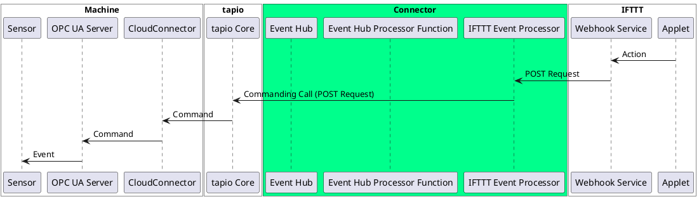

```plantuml
@startuml

box "Machine" #ffffff
    participant Sensor
    participant "OPC UA Server"
    participant CloudConnector
end box

box "tapio" #ffffff
    participant "tapio Core"
end box

box "Connector" #00ff8c
    participant "Event Hub"
    participant "Event Hub Processor Function"
    participant "IFTTT Event Processor"
end box

box "IFTTT" #ffffff
    participant "Webhook Service"
    participant Applet
end box

Applet->"Webhook Service": Action
"Webhook Service"->"IFTTT Event Processor" : POST Request
"IFTTT Event Processor"->"tapio Core" : Commanding Call (POST Request)
"tapio Core"->CloudConnector : Command
CloudConnector->"OPC UA Server" : Command
"OPC UA Server"->Sensor : Event

@enduml
```