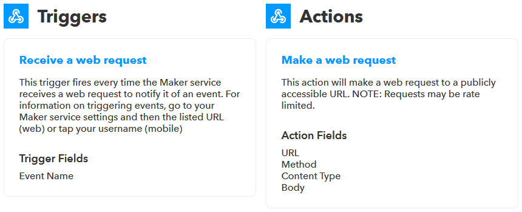

# Connecting the digital worlds

Hello world! As a dual student at HOMAG I took my chance to represent the HOMAG Digital Factory at [#hackthewood2019](http://www.hackthewood.com) in Berlin. In this article I want to share how we built an idea into a working prototype in less than four days.

## The idea

The challenge I was responsible for - connecting the digital worlds - consisted of the implementation of a rather simple idea: Connecting the tapio ecosystem with [IFTTT](https://ifttt.com/).

IFTTT or "**IF T**his **T**hen **T**hat" is an Internet of Things and automation platform which can be used by anyone even without technical knowledge. As the name suggests it's all about very simple automations which you can click together in their website or mobile app like:

* **IF** I like a music video on YouTube **THEN** add it to my Spotify library.
* **IF** my vacuum cleaner is stuck somewhere **THEN** send me a push notification to my smartphone.

If the tapio ecosystem was connected with IFTTT a carpenter could setup individual automations on his own like:

* **IF** my CNC machine set off an alarm **THEN** turn on pulsing Philips Hue lights so that a nearby employee is informed and can investigate the issue.
* **IF** I tell Amazon Alexa to turn on my edge banding machine **THEN** my edge banding machine starts up.

### How does IFTTT work?

At IFTTT things are simple, which is great because it enables everyone to use the platform.

An IFTTT-Service can be any kind of digital platform like YouTube, iRobot, Wordpress or tapio. However after a successful integration into IFTTT every service only consists of a brand, triggers and actions anymore.

An IFTTT-Trigger can be used to listen for an event to occur in its origin service. For example the BMW Labs service provides among others following trigger:

As you can see a trigger has a name, a description and an amount of properties which can be transmitted to given service.

On the contrary an IFTTT-Action can be used to invoke something in its origin service. Actions are built with the same pattern as triggers like another example from the BMW Labs service:

Finally one can combine a trigger with an action from any service, which is then called an IFTTT-Applet. Applets can be shared and discovered on [IFTTT.com](http://www.ifttt.com/discover) in the discover section. An excerpt:

## The implementation

On the first day of the hackathon we used the available time to create an implementation plan broken down to small tasks. The remaining time until the presentation session on the fourth day, where all teams showcased their prototypes, consisted of coding, reading documentation and scratching our heads.

As integrating tapio into IFTTT [the official way](https://platform.ifttt.com/docs) would've been a project on its own and required access to tapio internal structures we used an IFTTT-Service called [Webhooks](https://ifttt.com/maker_webhooks) instead. There is no official specification on what exactly a Webhook is but it's generally accepted to think of a Webhook as an endpoint for a HTTP call which when called triggers something. If you're familiar with programming you could also think of a Webhook as being a call to a function over the internet. The IFTTT Webhook service provides a trigger which can receive HTTP calls and an action which can send HTTP calls. Therefore it can be used as an interface to inject and receive any kinds of events.

So there were two event flows we had to implement: From tapio-ready machines to IFTTT and back.

### Building a demo machine

In order to test the tapio-IFTTT-Connector as we were developing it and also to showcase our accomplishments later on we needed a test machine which

* could run the tapio CloudConnector,
* could run a OPC UA server,
* has an input so that we could trigger events
* and has an output so that it could process actions.

The tapio CloudConnector is the piece of software from tapio which has to be installed on a machine so that it can connect to the tapio ecosystem. CloudConnector can speak a machine to machine communication protocol called [OPC UA](https://opcfoundation.org/about/opc-technologies/opc-ua/) which we can use to hook up input and output components with CloudConnector.

The first idea that came to mind was to use a [Raspberry Pi](https://www.raspberrypi.org/). It's cheap, reliable and easy to set up. It also provides a GPIO-interface which can be used to connect any input or output component like a motion sensor as input and a RGB LED as output.

So we went ahead, got ourself a Pi, installed [Raspbian Lite](https://www.raspberrypi.org/downloads/raspbian/) and set up SSH access. Then we took a look at the [tapio developer portal](https://developer.tapio.one) to figure out how to install the tapio CloudConnector linux. When the CloudConnector was running on the Pi we then continued with setting up [remote debugging with Visual Studio Code](https://www.hanselman.com/blog/RemoteDebuggingWithVSCodeOnWindowsToARaspberryPiUsingNETCoreOnARM.aspx). This way the implementation of the sensor-connecting OPC UA server was a lot easier. To access the GPIO pins we used the NuGet packages [Unosquare.RaspberryIO](https://github.com/unosquare/raspberryio) and [System.Device.Gpio](https://www.nuget.org/packages/System.Device.Gpio). The latter even offered the possibility to provide a custom event handler for GPIO pin status changes which simplified listening for events by a bit.

### Building the connector

As there were two routes for events we focused on one at a time. First we took a look at the path events take when they're coming from IFTTT:

1. An IFTTT-Applet was triggered which sent a HTTP request through the Webhook action to our connector.
2. The connector received a HTTP request from IFTTT.
3. The connector forwards the event via the tapio commanding API to the corresponding CloudConnector instance.
4. CloudConnector received the commanding request and forwarded it as a call to the preconfigured OPC UA server.
5. The OPC UA server processed the event.

The tapio commanding API is normally used to alter items or call methods on a OPC UA server associated with the CloudConnector but we figured we can use a item write request to transmit an event. On OPC UA server side we then just had to wait for item state changes and interpret them as events. In detail we used an `DataVariableState` of type `String` and used the value to transmit a serialized JSON object.
When we noticed that our connector only had to listen for a http request and then make another http request we opted for a [serverless](https://martinfowler.com/articles/serverless.html) approach using an [Azure Function](https://docs.microsoft.com/en-us/azure/azure-functions/) to save time (A Azure Function basically is a piece of code which gets executed when a certain condition arises).

For testing our function the command-line program [ngrok](https://ngrok.com/) came in handy. Through ngrok you can expose a local development server to the internet. This way you can debug webhooks directly on your local machine without exposing ports or renting a webserver.

After the first event flow worked we started working on the second:

1. A sensor of a machine changed its state.
2. The state change was forwarded to the machines OPC UA server.
3. The OPC UA server invoked a OPC UA event.
4. The CloudConnector forwarded the event to the tapio core.
5. The tapio core forwarded the event to a custom EventHub (preconfigured for given tapio machine id).
6. The connector received a new event in the EventHub.
7. The connector forwarded the event via webhook to IFTTT.
8. An IFTTT-Applet triggered an action from any service.

An [Azure EventHub](https://azure.microsoft.com/en-us/services/event-hubs/) can listen for many events at the same time and provide a queue which event consumers can work through to process all events. We set up an EventHub instance in Azure and connected it through [my tapio](https://admin.tapio.one/) with our machine. Then we set up another Azure Function which consumed events from given EventHub and forwarded them to IFTTT through the webhook service.

## Conclusion

That's it! Two Azure Functions, an EventHub, a Raspberry Pi and three workdays later we're able to present a functioning prototype. For our demo on day four we logged motion sensor data through our connector into a Google Drive sheet, turned on a RGB LED with the press of a widget button on a smartphone and configured a new IFTTT-Applet live. We didn't develop a shippable product but built a working proof of concept which can be transformed into a proper solution. Authentication, authorization and a web interface for configuring events to be be forwarded on a per machine basis are tasks still to be done.