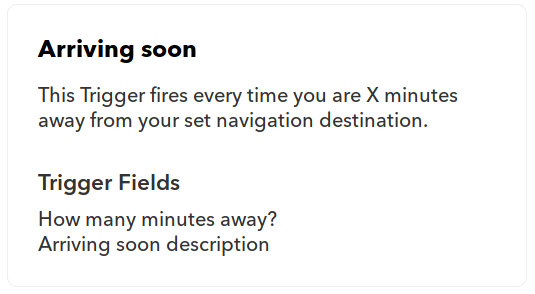

# Connecting the digital worlds

Hello world! As a dual student at HOMAG I took my chance to represent the HOMAG Digital Factory at [#hackthewood2019](http://www.hackthewood.com) in Berlin. In this article I want to share how we built an idea into a working prototype in less than four days.

## The idea

The challenge I was responsible for - connecting the digital worlds - consisted of the implementation of a rather simple idea: Connecting the tapio ecosystem with [IFTTT](https://ifttt.com/).

IFTTT or "**IF T**his **T**hen **T**hat" is an Internet of Things and automation platform which can be used by anyone even without technical knowledge. As the name suggests it's all about very simple automations which you can click together in their website or mobile app like:

* **IF** I like a music video on YouTube **THEN** add it to my Spotify library.
* **IF** my vacuum cleaner is stuck somewhere **THEN** send me a push notification to my smartphone.

If the tapio ecosystem was connected with IFTTT a carpenter could setup individual automations on his own like:

* **IF** my CNC machine set off an alarm **THEN** turn on pulsing Philips Hue lights so that a nearby employee is informed and can investigate the issue.
* **IF** I tell Amazon Alexa to turn on my edge banding machine **THEN** my edge banding machine starts up.

### How does IFTTT work?

At IFTTT things are simple, which is great because it enables everyone to use the platform.

An IFTTT-Service can be any kind of digital platform like YouTube, iRobot, Wordpress or tapio. However after a successful integration into IFTTT every service only consists of a brand, triggers and actions anymore.

An IFTTT-Trigger can be used to listen for an event to occur in its origin service. For example the BMW Labs service provides among others following trigger:

As you can see a trigger has a name, a description and an amount of properties which can be transmitted to given service.

On the contrary an IFTTT-Action can be used to invoke something in its origin service. Actions are built with the same pattern as triggers like another example from the BMW Labs service:

Finally one can combine a trigger with an action from any service, which is then called an IFTTT-Applet. Applets can be shared and discovered on [IFTTT.com](http://www.ifttt.com/discover) in the discover section. An excerpt:

