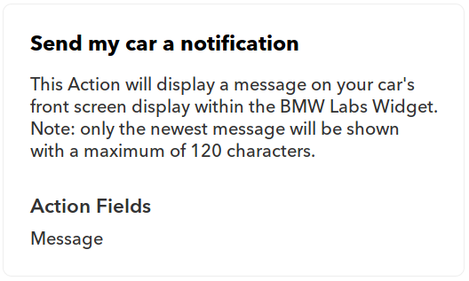

# Connecting the digital worlds

Hello world! As a dual student at HOMAG I took my chance to represent the HOMAG Digital Factory at [#hackthewood2019](http://www.hackthewood.com) in Berlin. In this article I want to share how we built an idea into a working prototype in less than four days.

## The idea

The challenge I was responsible for - connecting the digital worlds - consisted of the implementation of a rather simple idea: Connecting the tapio ecosystem with [IFTTT](https://ifttt.com/).

IFTTT or "**IF T**his **T**hen **T**hat" is an Internet of Things and automation platform which can be used by anyone even without technical knowledge. As the name suggests it's all about very simple automations which you can click together in their website or mobile app like:

* **IF** I like a music video on YouTube **THEN** add it to my Spotify library.
* **IF** my vacuum cleaner is stuck somewhere **THEN** send me a push notification to my smartphone.

If the tapio ecosystem was connected with IFTTT a carpenter could setup individual automations on his own like:

* **IF** my CNC machine set off an alarm **THEN** turn on pulsing Philips Hue lights so that a nearby employee is informed and can investigate the issue.
* **IF** I tell Amazon Alexa to turn on my edge banding machine **THEN** my edge banding machine starts up.

### How does IFTTT work?

At IFTTT things are simple, which is great because it enables everyone to use the platform.

An IFTTT-Service can be any kind of digital platform like YouTube, iRobot, Wordpress or tapio. However after a successful integration into IFTTT every service only consists of a brand, triggers and actions anymore.

An IFTTT-Trigger can be used to listen for an event to occur in its origin service. For example the BMW Labs service provides among others following trigger:

As you can see a trigger has a name, a description and an amount of properties which can be transmitted to given service.

On the contrary an IFTTT-Action can be used to invoke something in its origin service. Actions are built with the same pattern as triggers like another example from the BMW Labs service:

Finally one can combine a trigger with an action from any service, which is then called an IFTTT-Applet. Applets can be shared and discovered on [IFTTT.com](http://www.ifttt.com/discover) in the discover section. An excerpt:

## The implementation

Integrating tapio into IFTTT [the official way](https://platform.ifttt.com/docs) would've been a project on its own and required access to tapio internal structures.

Therefore we used an IFTTT-Service called [Webhooks](https://ifttt.com/maker_webhooks). There is no official specification on what exactly a Webhook is but it's generally accepted to think of a Webhook as an endpoint for a HTTP call which when called triggers something. If you're familiar with programming you could also think of a Webhook as being a call to a function over the internet. The IFTTT Webhook service provides a trigger which can receive HTTP calls and an action which can send HTTP calls. Therefore it can be used as an interface to inject and receive any kinds of events.

So there were two event flows we had to implement: From tapio-ready machines to IFTTT and back.

### Building a demo machine

In order to test the tapio-IFTTT-Connector as we were developing it and also to showcase our accomplishments later on we needed a test machine which

* can run the tapio CloudConnector,
* can run a OPC UA server,
* has an input so that we can trigger events
* and has an output so that it can process actions.

The first idea that came to mind was to use a [Raspberry Pi](https://www.raspberrypi.org/). It's cheap, reliable and easy to set up. It also provides a GPIO-interface which can be used to connect any input or output component like a motion sensor as input and a RGB LED as output.