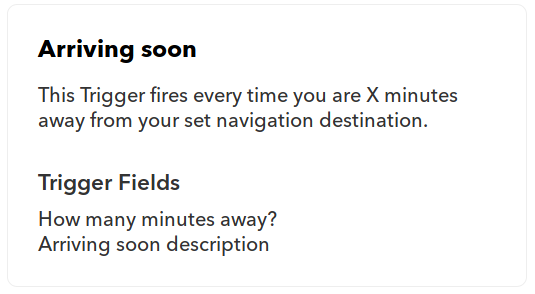
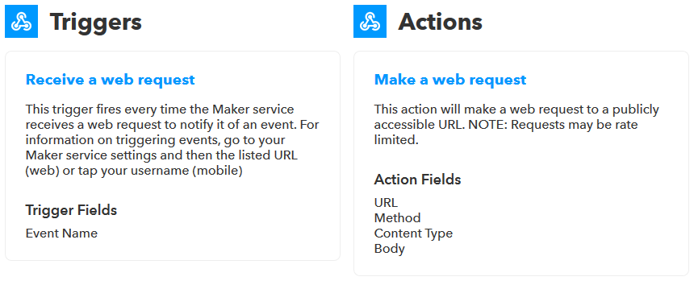
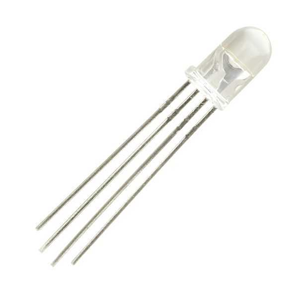

---
title:
- tapio goes IFTTT
author:
- Simon Eßlinger
date:
- 20. May 2019
theme:
- Copenhagen
classoption: "aspectratio=169"
---

## The Idea

The idea is simple: We want to connect the tapio ecosystem with [IFTTT](https://ifttt.com/). This enables every owner of a tapio ready machine to automate his daily business using one or more out of over 600 services.

### IFTTT

IFTTT or "**IF T**his **T**hen **T**hat" is an IoT (Internet of Things) automation platform. As the name suggests it's all about very simple connections like these:

* **IF** I like a music video on YouTube **THEN** add it to my Spotify library.
* **IF** my vacuum cleaner is stuck somewhere **THEN** send me a push notification.
* **IF** my CNC machine set off an alarm **THEN** safe the last 5 minutes of the video feed of my webcam which was monitoring the machine.

#### IFTTT Service

An IFTTT service can be any kind of digital platform like YouTube, iRobot or Wordpress which decides to hook up with IFTTT. After a successful IFTTT integration a service has to provide at least one [trigger](#ifttt-trigger) or [action](#ifttt-action).

#### IFTTT Trigger

As the name suggests IFTTT triggers can be used in [IFTTT Applets](#ifttt-applet) to invoke automations. For example the BMW Labs service provides among others following trigger:

One could also say that IFTTT triggers are external input for the IFTTT platform.

#### IFTTT Action

An IFTTT action is the counterpart to a [IFTTT trigger](#ifttt-trigger). Another example from the BMW Labs service:

#### IFTTT Applet

An IFTTT applet combines a [trigger](#ifttt-trigger) with an [action](#ifttt-action) from any service. IFTTT users can create, share and configure any number of applets for free.
Example with a trigger provided by Reddit and an action provided by IFTTT:

>Both triggers and actions provide fields which can be used to transfer data through a complete automation (eg. a link to post on Facebook).

## The Implementation Plan

Integrating tapio into IFTTT [the official way](https://platform.ifttt.com/docs) is a project on it's own and requires access to tapio internal structures and a contract between tapio and IFTTT.[ifttt-service-integration-timeline](assets/ifttt-service-integration-timeline.png)

Therefore we will use an IFTTT service called [Webhooks](https://ifttt.com/maker_webhooks). There is no official specification on what a Wehhook is but it's common sense to think of a Webhook as an endpoint for a http call which when called triggers something. You could also think of a Webhook being a function call over the interwebs. The IFTTT Webhook service provides a trigger which can receive http calls and an action which can send http calls:

After connecting the IFTTT Webhook service to your IFTTT account you can look up your individual URL on the [service page](https://ifttt.com/maker_webhooks).

### Building a demo machine

The greatest tapio-IFTTT connector isn't worth anything if one can't show its features. Therefore we will build a demo machine which

* can run the tapio CloudConnector,
* can run an OPC UA server,
* has an input so that we can trigger events
* and has an output so that it can process actions.

The first idea that comes to mind is to use a [Raspberry Pi](https://www.raspberrypi.org/). It's cheap, reliable and easy to set up. It also provides a GPIO interface which we can use to connect any input or output component like this [AM312](https://www.sunrom.com/p/micro-pir-motion-detection-sensor-am312) PIR sensor as input

and this simple RGB LED as output.

Quick summary:

* Install [Raspbian Lite](https://www.raspberrypi.org/downloads/raspbian/)
* Setup SSH access
* Install [dotnet](https://docs.microsoft.com/en-us/dotnet/core/tools/dotnet-install-script)
* Setup [tapio CloudConnector](https://developer.tapio.one/docs/CloudConnector/CloudConnectorCore.html)
* Setup [remote debugging with VS Code](https://www.hanselman.com/blog/RemoteDebuggingWithVSCodeOnWindowsToARaspberryPiUsingNETCoreOnARM.aspx)
* Setup the PIR sensor and the RGG LED using the GPIO interface and a library like [Unosquare.RaspberryIO](https://github.com/unosquare/raspberryio) and deploy an OPC UA server which monitors the motion sensor and controls the RGB LED.

### Building the connector

The tapio-IFTTT connector should be capable of:

* Send and receive events from IFTTT over Webhooks
* Send and receive events from tapio using
  * Microsoft Azure EventHub
  * tapio StateAPI
* Authenticating event processing requests

>For testing Webhooks the tiny program **ngrok** can come in handy. Ngrok can forward requets from the web to your local developer machine.